### Day 1 - Using Percentages and Avoiding Heights

<br/>

#### Percentages vs Fixed Width

1. By default, any element is responsive.
   1. Once you defined the `width` using `px`, you get a fixed position for that element.
   2. Reason being - plain html elements are going to be 100% of the `width`.
      1. Will always be **100% of the parent element**.
   3. **Common mistake** - **_setting up media queries_** to make it dynamic so that it can be responsive when changing the viewport size.
      <br/>

#### Percentages on the child

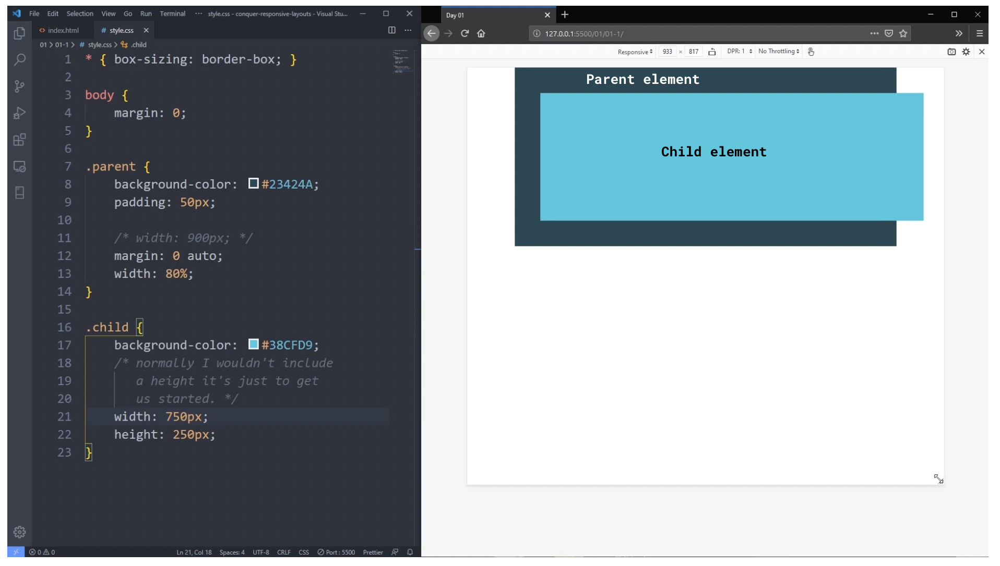

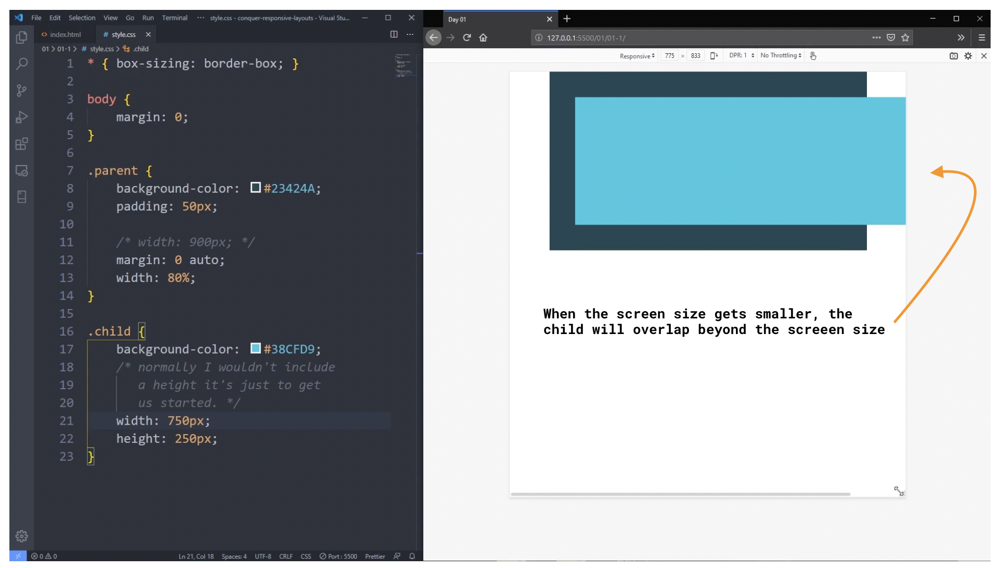

1. To show how a fixed `width` affects a child element compared to its parent, you will see that child can overflow the parent element and viewport size or screen size which causes side scrolling.
2. A possible counter to this issue - using `overflow: hidden`.
   1. **Consequences - you will also hide the content of the child**.

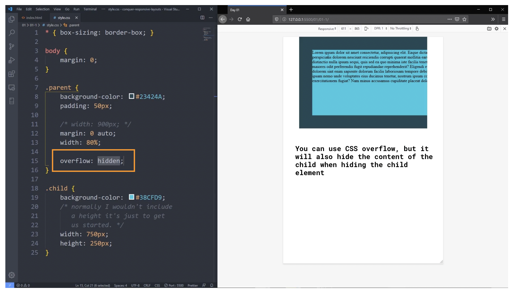

3. Setting the `width` of the child to prevent overflowing to the side, you can cause an overflow to the bottom. (_Another example of setting a fixed width that can cause issues with responsiveness_)

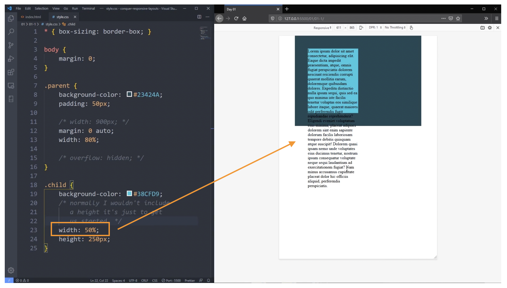

4. **Remember**: percentage in `width` for the child means a percentage of the parent's size

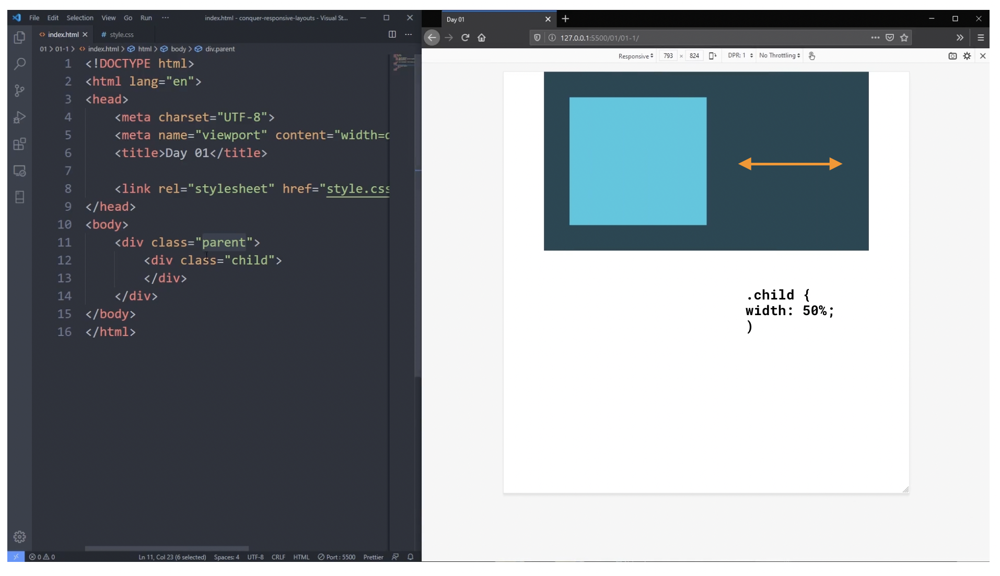

`.child { width: 50%; // means 50% of the parent element; refer to the above image }`

<br/>

**IMPORTANT**
You don't need to set a `width` to a child. You need to base it on the context of the code to determine if setting a `width` is necessary for a child. By default, elements are responsive until you define it.
<br/>
<br/>

#### Why It's A Good Idea To Avoid Heights

**General Rule**:
_There are times when you want to use `height`, but for the most part, they cause more issues than they solve. **CSS does not make something unresponsive. The coder is the one who defined something that makes it unresponsive**._
<br/>

You can see the content of the element will overflow, but will be hidden due to its parent element.
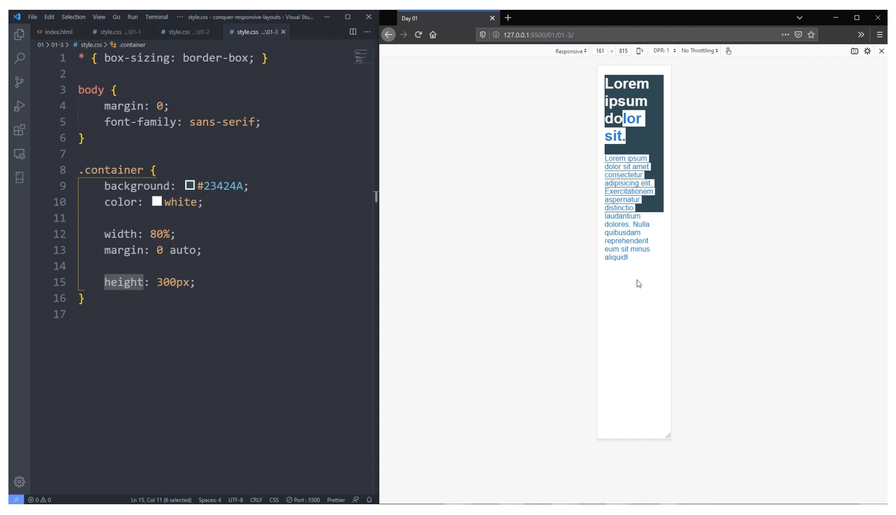

Let the content of the element defined the `height`. It will be responsive by default. It will automatically adapt to the `height` of the element it is working in.
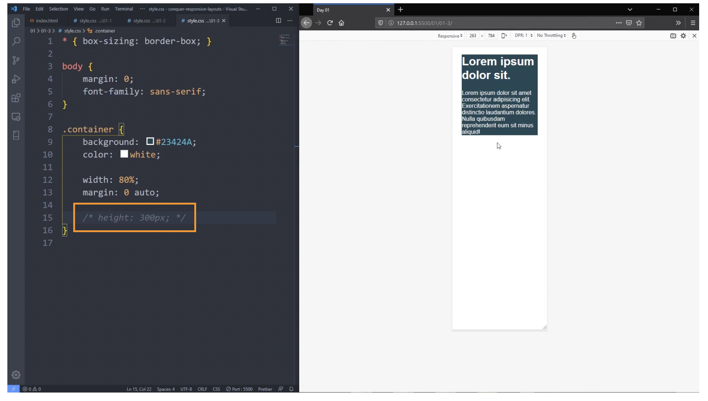

So what if you want more background? Well, you can set `padding`. `padding` **_will give you more background for the element_**.

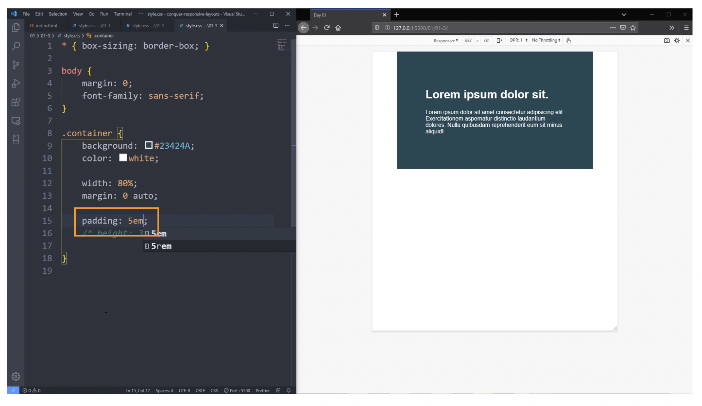
<br/>
<br/>

##### EM vs REM

`em`:

1. `1em = 16px`
2. if you set an element to `em`, it will set its sizing in relation to its parent.


3. so if the parent element has `em` value for its sizing, its child will be compounding its value when using `em` as well.
   - for example:

```
.parent {
   font-size: 2em; // 2em * 16px = 32px
}

.child {
   font-size: 2em; // 2em * 32px (parent) = 64px
}
```

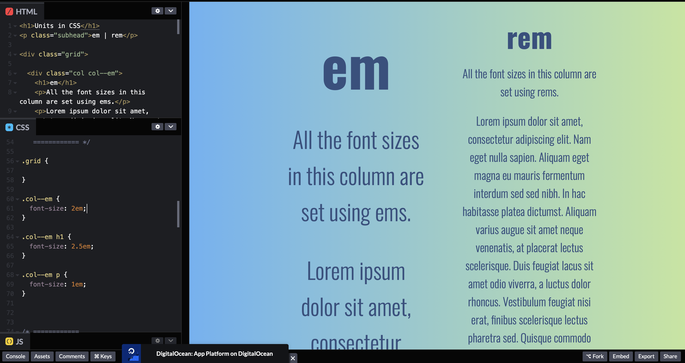
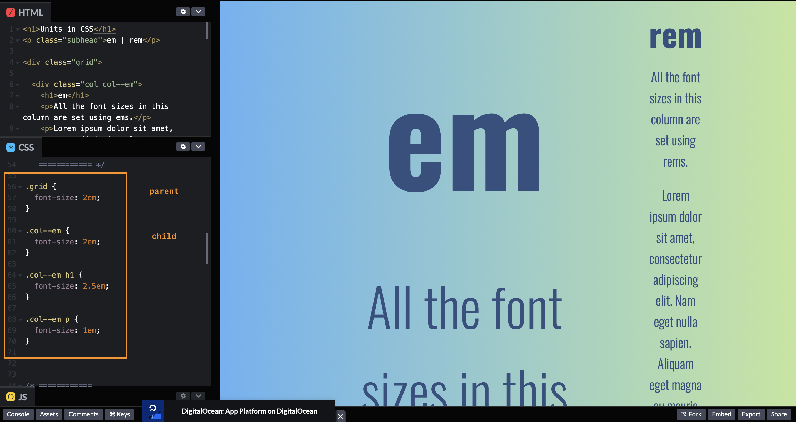
<br/>

`rem`:

1. this was created to solve the compounding issue with `em`
2. stands for `root em`
3. it will look at the main html sizing and not the body

```
// for example
html {
   font size: 1em or 1 rem or 16px;
}
```

4. `rem` is great for consistency because `em` will always compound from its parent while `rem` will always go to the `root`
5. usually the root is `html`
6. when you use `em` for `margin`, `padding`, `width`, etc., it will look at the `font size` for that element and compound its value so:
   - `font-size: 1em` will look at the parent
   - `margin: 1em` will look at `font-size: 1em` in the same element
7. `rem` will look at the root `html` font size and compound its value

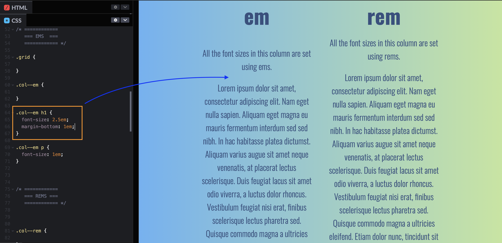
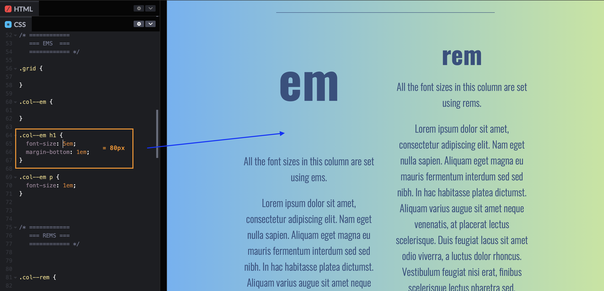

8. `em` is great to use for `btn`
9. `rem` can be great for `margin` as it keeps it consistent with its spacing
10. a good reason to use `rem` or `em` besides `px` is because of scalability
11. URL: https://www.youtube.com/watch?v=_-aDOAMmDHI
    <br/>
