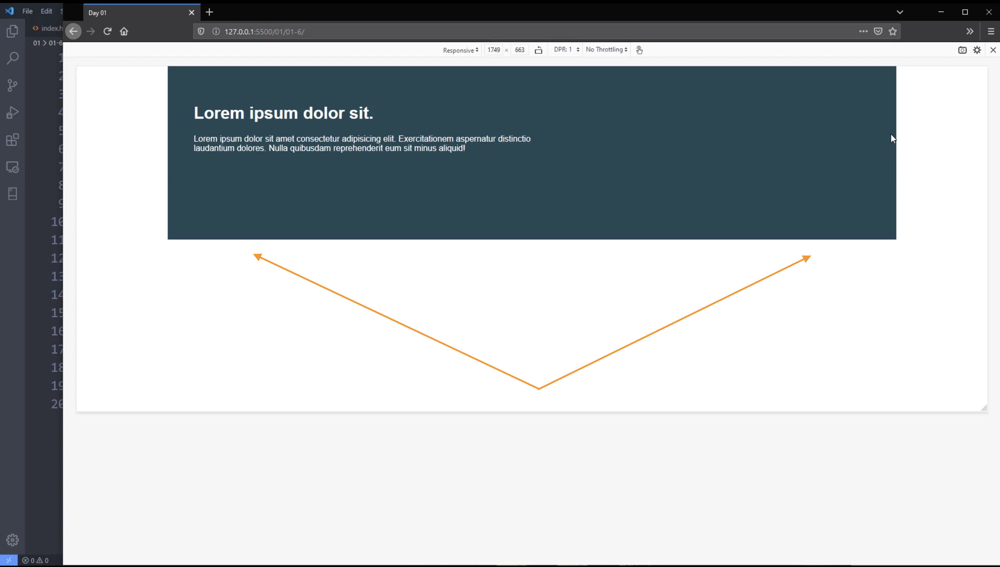
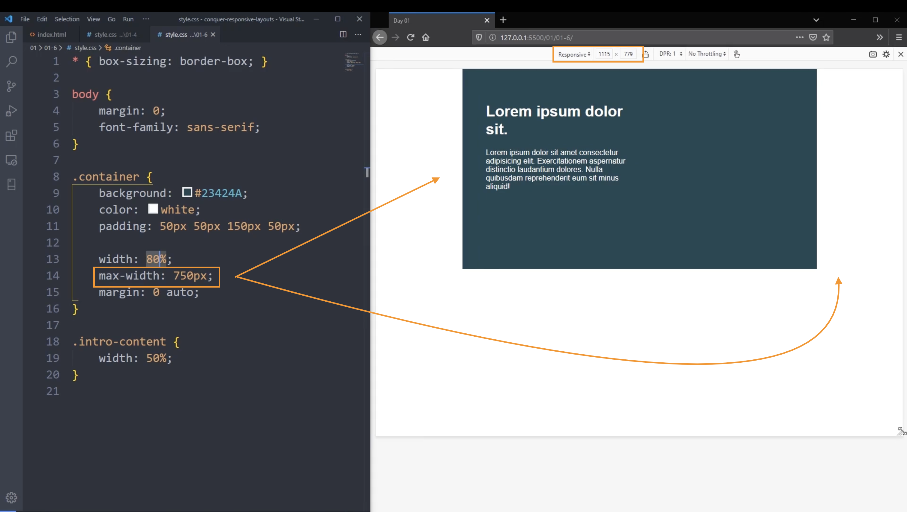

### Day 3 - Enter `max-width`

<br/>

#### Adding In A `max-width`

A common mistake that a developer can do is setting the `width` with a `%` value for responsiveness and not setting a limit.

_Side note_: You always want to use `%` for `width`.

It can stretch out the content of the `element` when reaching a wide `viewport`. For the below example, the `width` of the `container` will always be `80%` of the `viewport` of all sizes.

```
.container {
    padding: 50px 50px 150px 50px;
    margin: 0 auto;
    width: 80%;
}
```


<br/>

Now, if you set a `max-width` for the `element`, then it will understand that the `width` of the `container` will always be `80%` of the `viewport` as long as it is `750px` and below.container

```
.container {
    padding: 50px 50px 150px 50px;
    margin: 0 auto;
    width: 80%;
    max width: 750px;
}
```


