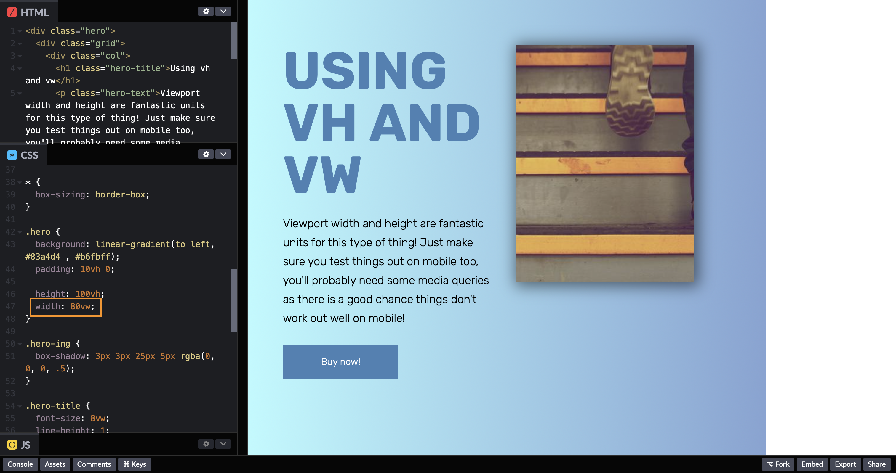

### CSS Units: `vh`, `vw`, `vmin`, `vmax`

- `vh` = viewport height
- `vw` = viewport width


<br/>

In the above example, it is a two column hero container with a background image on the bottom.

**_One thing you should do initially that will help with your layouts is using_** `box-sizing: border-box` **_for the universal selector._** So, something like this:

```
* { // * means universal selector; selects everything
    box-sizing: border-box;
}
```

If you use `100vh` for the height in the hero container, it will extend the container to 100% of browser's window. If you were to change the size of the browser(shortening the browser for example), the hero container will dynamically change to that size.


> Just showing what it looks like when using `vw` for width.


<br/>

The negative side of using `vh` or `vw` will be on mobile devices. Images or content inside a container can overlap outside its borders.


To counter this, you will need to use media queries.
<br/>

> **Remember using percentages is based off of its parent's element.**

Using the Buy Now button's width, we will make it `100%` to show that it will be 100% of the width of its parent `<div class="col">`.


Now, what if you use `vw` for its width? It will extend itself to the browser's window and put out the parent's content to the same width and pushing out any containers next to it as well.


---

##### `vmax` and `vmin`

The `vmin` and `vmax` units allow you to access the size of the smaller or the larger side of the viewport, according to the following rules:

```
100vmin = 100vw or 100vh, whichever is smaller
1vmin = 1vw or 1vh, whichever is smaller

100vmax = 100vw or 100vh, whichever is larger
1vmax = 1vw or 1vh, whichever is larger
```

So, in case of a portrait orientation, `100vmin` is equal to `100vw`, as the viewport is smaller horizontally than vertically. For the same reason, `100vmax` will be equal to `100vh`.

Similarly, in case of a landscape orientation, `100vmin` is equal to `100vh`, as the viewport is smaller vertically than horizontally. And, of course, `100vmax` will be equal to `100vw` here.
