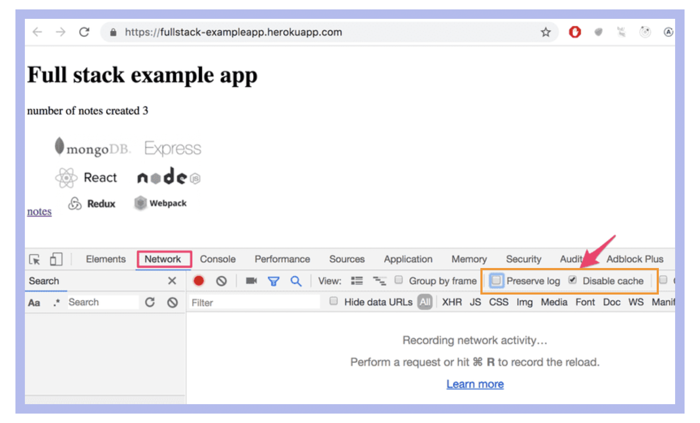
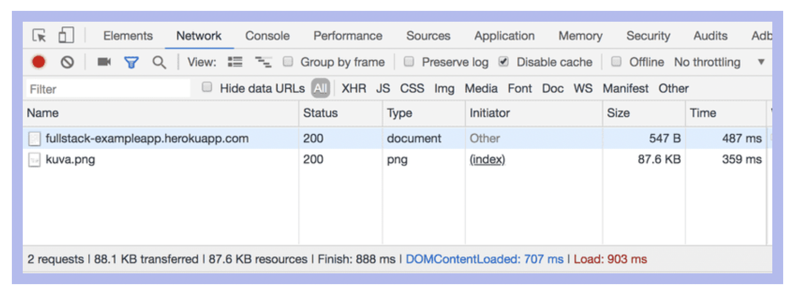
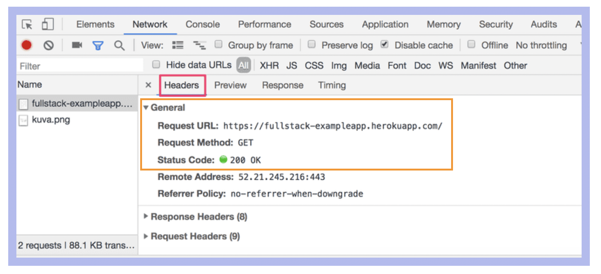

### Part 0 - Fundamentals of Web Apps

- check `Disable cache` option
- `Preserve log` can be useful: it saves the logs printed by an application when the page reloads.
   

#### HTTP GET

The server and the browser communicates via HHTP protocol. When you relad a page, the console will show two events that happened:

- browser has fetched the content of the page from the server
- and has downloaded the image

Clicking on the first event will show the following:

`General` will show the browser made a request to the address using the `GET` method, and that response was successful, because the server response had the status code `200`.

The request and server response have several headers:
