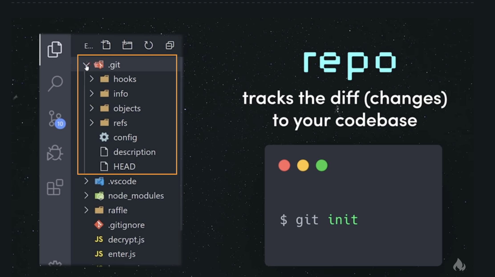
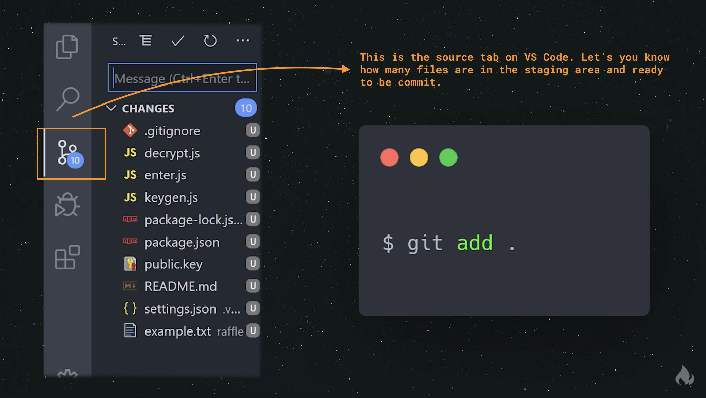
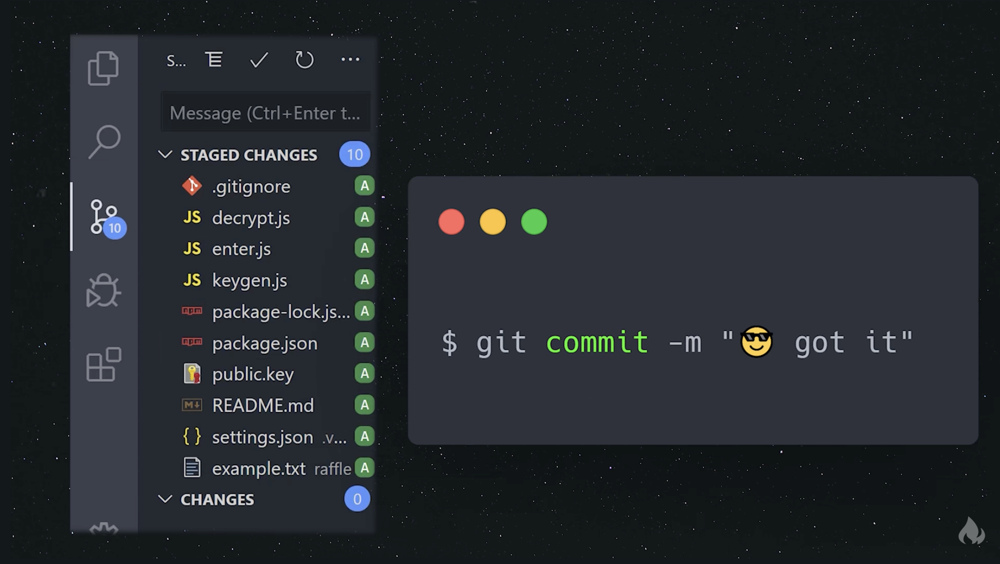
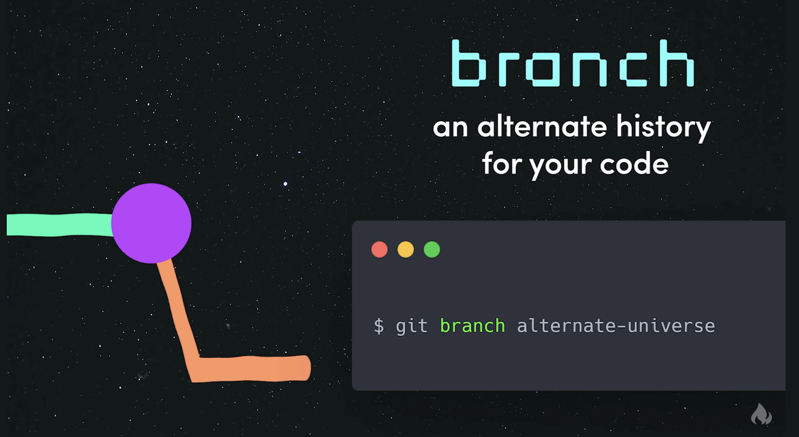
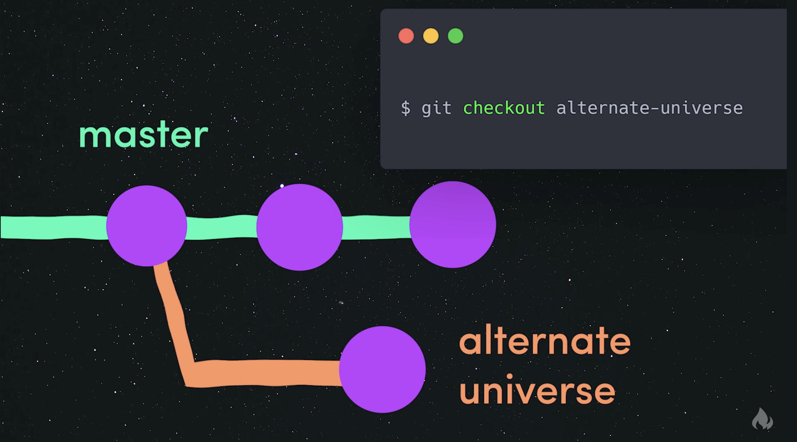

### Git Started

 

#### What is Git?

Essentially, a way to track changes for your codebase.

To create a repository, you will run `git init` in your terminal or editor. It will create a hidden directory labeled `git` in your codebase. **This will keep track of your files**.

Every `commit` is a snapshot of your current files which will have an unique ID that is linked to the parent. You can load up a previous commit to "go back in time" with that codebase to make any changes if necessary.
 

##### To add files to the repo:

1. In the terminal, type `git add .`
   - this will setup all of your files in the _staging_ area
   - essentially, creating a snapshot of your codebase

 

2. `git commit -m "Text"`
   - this will take a snapshot of your files and you can leave a message about the files

- this is creating a commit with the **head** of the master branch
- the **head** of the branch is the most recent commit

 

1. `git branch "name of alternate branch"`
   - when you create a branch, you are pulling a codebase that you can work on safely without affecting the master branch
   - any commits in this alternate branch will have its own unique ID and history

 

4. `git checkout` and `git merge "name of alternate branch"`
   - when you're ready to merge the codebase and history to the master branch then you run `git checkout`
   - then you run `git merge alternate branch` to merge it back to the master branch
   - your feature branch now becomes the head of the master branch combining into a single codebase
      
      

#### Install

If you want to
