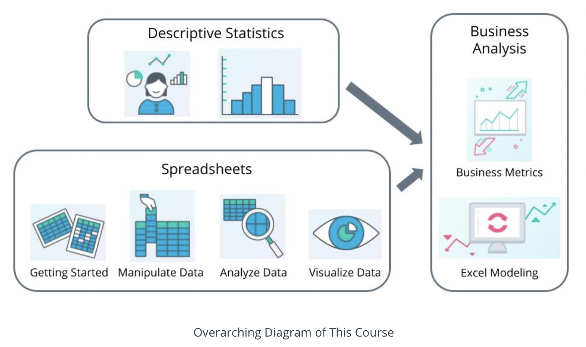
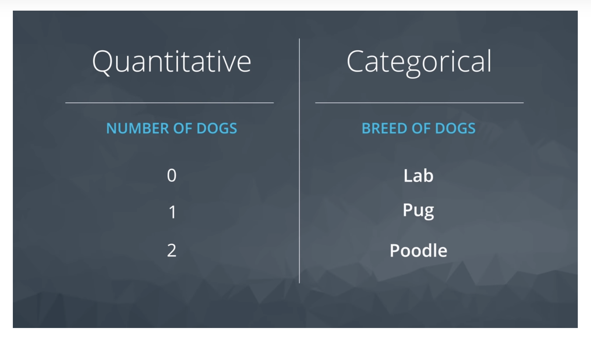

### Descriptive Statistics

#### Overview

1. Evaluate data types and variable types
2. Analyze measures of center
3. Implement notation

Descriptive analysis is useful in the following:

- business analytics
- data analysis
- data engineering
- product management
   

###### Data And Its Importance

**_Data_** is defined as distinct pieces of information.
 

###### Data Types

**_Quantitative_** data takes on numeric values that allow us to perform mathematical operations.
**_Categorical_** data is used to label a group or set of items.

Example:

