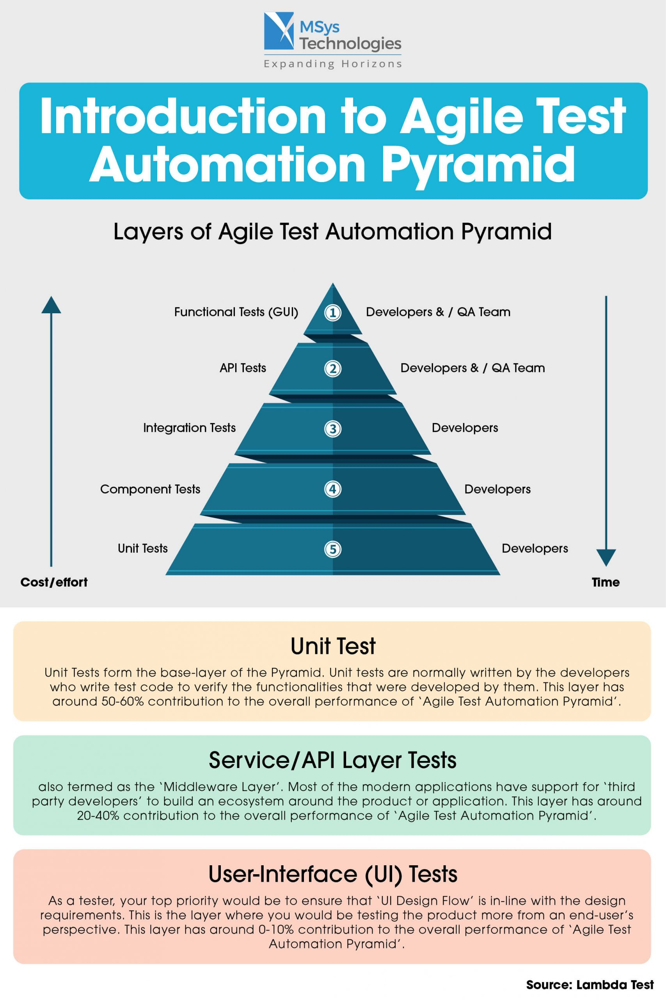
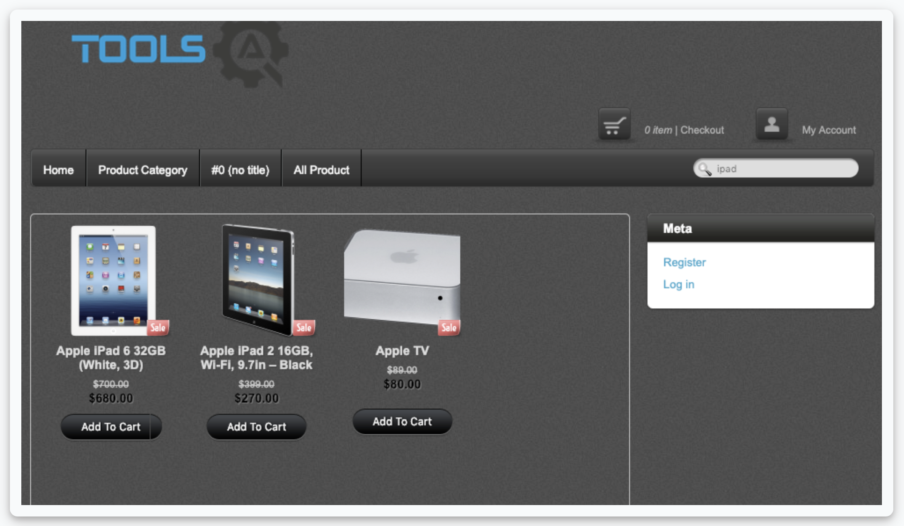

### Setting Up a Successful Test Automation Foundation

 

#### Testing Automation Pyramid

 

#### 3 Levels of Automated Testing

 

##### Unit Testing (lowest level)

To have fast feedback for your testing, automate your test close to production code. These are quick to write and quick to execute. Unit tests are small modular tests that verify logic of individual functions without the need for integration of other functionality, databases, or user interfaces.

They are able to pinpoint the exact function in which a bug exists. The bulk of automated tests are written at this level. Best written by product developers.
 

##### Service or API Testing (mid level)

This test focuses on the functionality that the code provides without the user interface. Tests can make calls to the product's API and/or business logic to verify integration of various functions. This will contain the second largest number of automated tests.
 

##### UI Testing

These tests take longer to write, take longer to execute, and dependent upon the consistency of the UI. Because of those reasons, they should contain the least number of tests.
 

When considering a test for automation, determine what info the test needs to verify, and choose the lowest level possible to write the test against. It seems practical to automate tests at the UI level to verify that the application looks the way it's supposed to and that the controls work. You should verify the UI, but all the steps required for the test case do not have to be executed at that level.
 

#### Example - Testing Search Feature

Your team created a new search feature. You want to verify that when serarching for products, that the correct results are returned, that the results appear as they should, and that any other filtering, sorting, column selection, or pagination is working. If automating one search test, then automate it at the UI level and perform all those UI-level checks.

If you need to automate multiple search tests, it will be too costly to do it at the UI level. You can automated one test at the UI level, and the rest at a lower level. You already verified the UI components and now you testing the functionality of the search algorithm. This can be verified at the service or unit level.
 

#### Example - Testing Adding Product to Cart

Scenario steps include:

1. Searching for the product.
2. Looking through the search results to find the project you want.
3. Clicking on the product.
4. Clicking the Add to Cart button.
5. Clicking the cart icon to get to the cart.
6. Verifying that the item is actually in the cart.

Automating these steps at the UI level is risky. If any of those steps fail due to brittleness of navigating the UI, the test won't get to the step that you actually care about.

You already added a UI level test to your suite, so you can bypass that in this new scenario. Instead, look for **seams - or shortcuts -** in your app which makes automating easier.

Instead of searching for the product, you can go straight to the product's URL within your automated test. That's the seam and will save a lot fo time and mitigate some of the risk of using the UI by eliminating the steps
