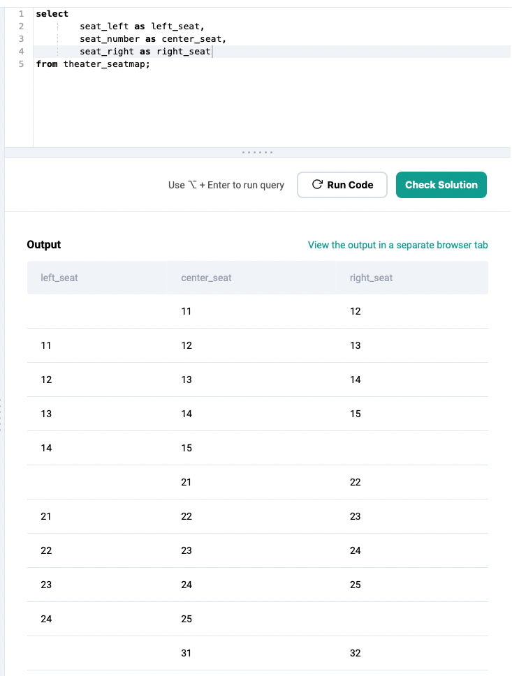
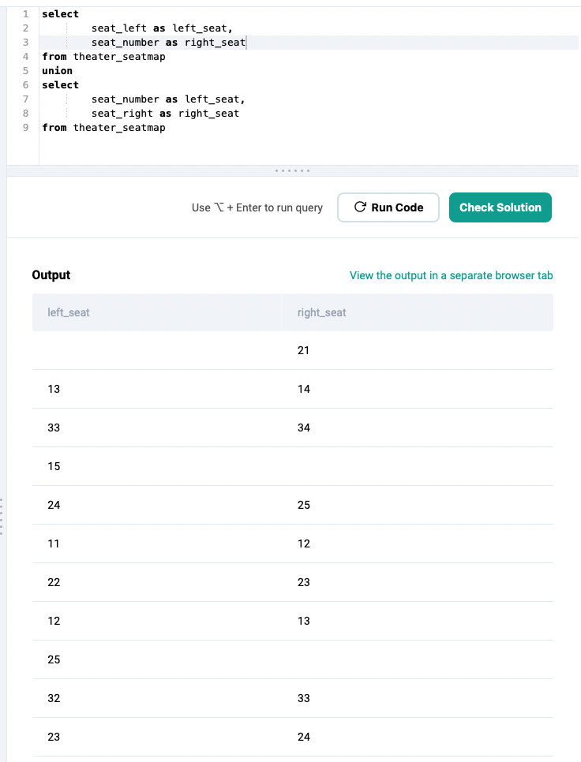
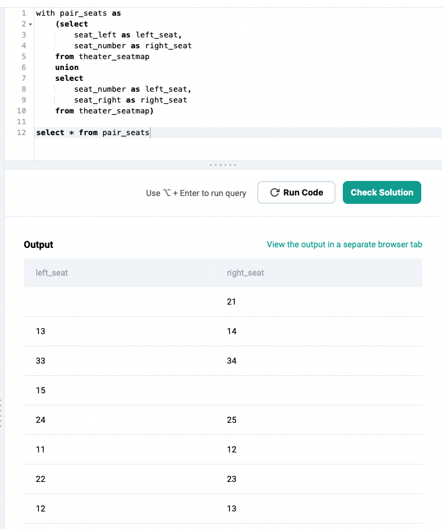

### Practice SQL ID: 2088

www.Stratascratch.com


##### `theater_availability` table


##### `theater_seatmap` table


<br>

---

#### Understand the problem first

```
// Breakdown of problem

1. Find all adjacent seats
2. Check if left seat is available
3. Check if right seat is available
```

<br>

---

#### // Find all adjacent seats

You want to rearrange `theater_seatmap` table so you can visually see adjacent pairs.

```
select
        seat_left as left_seat,
        seat_number as center_seat,
        seat_right as right_seat
from theater_seatmap
```


<br>

```
select
        seat_left as left_seat,
        seat_number as right_seat
from theater_seatmap
union
select
        seat_number as left_seat,
        seat_right as right_seat
from theater_seatmap

-- using UNION clause to remove duplicate rows in result set by using seat_number column
-- combine left_seat to seat_number
-- combine right_seat to seat_number
-- now you have a more visual representation of pair seats
```


<br>

##### Additional Note

> **`UNION`** clause:
>
> combines the result set of two or more **`SELECT`** queries without returning duplicating values
> removing duplicates is similar to **`DISTINCT`**
> number and order of columns in both queries must be the same
> data types must be compatible
> to retain duplicate rows, use **`UNION ALL`**

<br>

Next, store query into an auxiliary statement or temp table using **`WITH`** clause.

```
with pair_seats as
    (select
        seat_left as left_seat,
        seat_number as right_seat
    from theater_seatmap
    union
    select
        seat_number as left_seat,
        seat_right as right_seat
    from theater_seatmap)

select * from pair_seats
```


<br>

---

#### // Check if left seat is available

Now, joining tables to check if the left seat is available.
