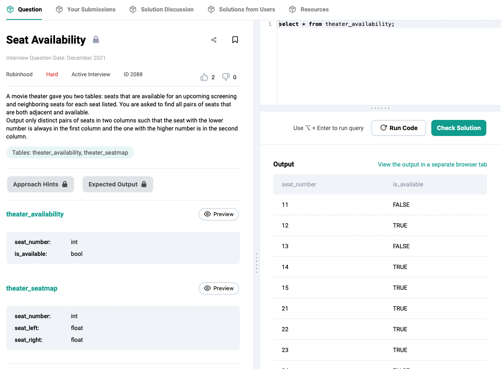
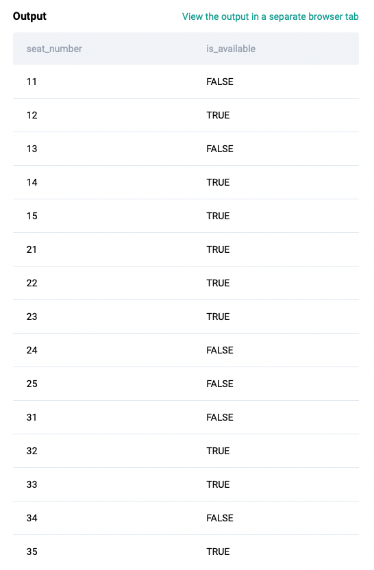
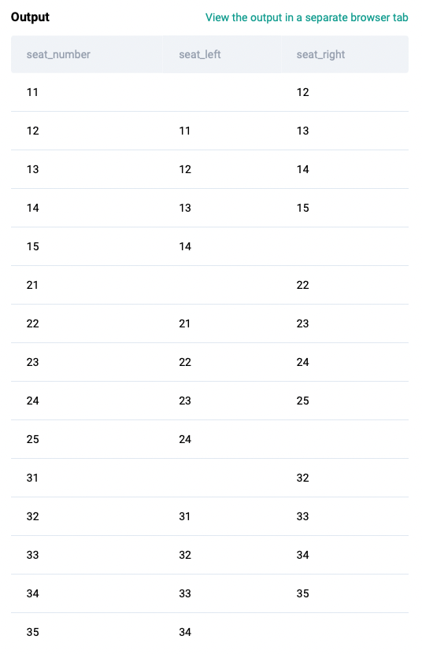

### Practice SQL ID: 2088

www.Stratascratch.com



##### `theater_availability` table



##### `theater_seatmap` table


<br>

---

#### Understand the problem first

```
// Breakdown of problem

1. Find all adjacent seats
2. Check if left seat is available
3. Check if right seat is available
```

<br>

---

#### // Find all available pair seats
