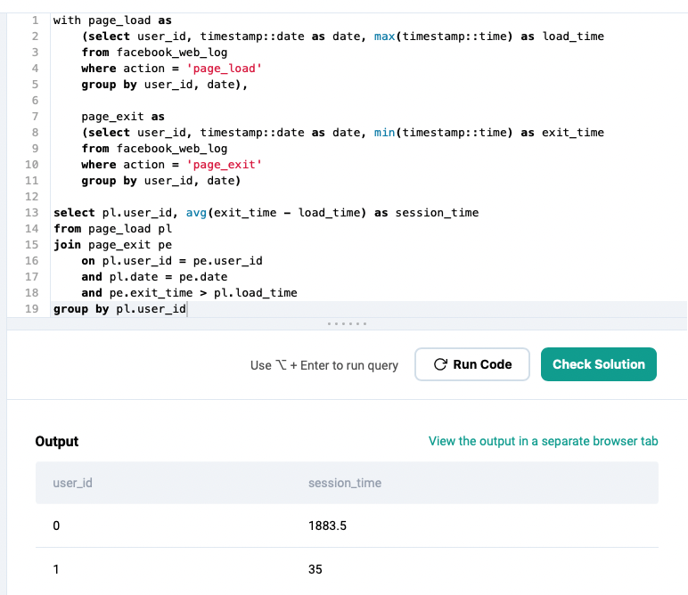

### Practice SQL Questions

www.Stratascratch.com


#### Understand the problem first

When trying to solve the problem, try to break down the problem to smaller parts where you can identify and provide one, simplest answer. Then merge those parts together to come up with the final, complex solution.

```
// This is PostgreSQL
// Look at Beekeeper Studio as an editor


Find avg session time per user.

// Breakdown of problem
1. Find the page_load time for each user per day (max)
2. Find the page_exit time for each user per day (min)
3. Find the session time = (page_exit - page_load)
4. Find the avg session time based on each user
```

<br/>

---

#### // Find page_load time for each user per day (max)

```
select * from facebook_web_log
where action = 'page_load'

-- basic query to find records for 'page_load'
```


<br/>

```
select user_id, timestamp::date as date, timestamp::time as load_time
from facebook_web_log
where action = 'page_load'

-- breakdown timestamp column and convert it into two columns: date (date data type), load_time (time data type)

// Additional Note
-- '::' is PostgreSQL; it shorthand for CAST
-- can't use [] to alter column name in PostgreSQL
```


<br/>

```
select user_id, timestamp::date as date, max(timestamp::time) as load_time
from facebook_web_log
where action = 'page_load'
group by user_id, date

-- grouping user_id and date columns
-- aggregate function is use for the result column which is load_time
```


<br>

##### Additional Note

> **`GROUP BY`** clause:
>
> - group rows that have the same value into a summary row
> - often used with aggregate functions to group result data set by one or more columns
> - "list the number of something in EACH GROUP (BY)"

<br>

Now, you can insert the above query into an auxiliary statement using the **`WITH`** clause. This creates a temporary table that you can use in your primary query. Think subquery.

```
with page_load as
    select user_id, timestamp::date as date, max(timestamp::time) as load_time
    from facebook_web_log
    where action = 'page_load'
    group by user_id, date
```


<br>

##### Additional Note

> **`WITH`** clause:
>
> - auxiliary statement for use in a larger query
> - often referred as Common Table Expressions (CTE)
> - defining a temporary table that exist just for one query
> - each aux statement can be a **`SELECT`**, **`INSERT`**, **`UPDATE`**, **`DELETE`**
> - is attached to a primary statement that can also be the above

<br>

---

#### // Find the page_exit time for each user per day (min)

The query used for `page_load` will be the same for `page_exit` except you are going to look for the earliest data for `page_exit`.

```
with page_load as
    (select user_id, timestamp::date as date, max(timestamp::time) as load_time
    from facebook_web_log
    where action = 'page_load'
    group by user_id, date),

    page_exit as
    (select user_id, timestamp::date as date, min(timestamp::time) as exit_time
    from facebook_web_log
    where action = 'page_exit'
    group by user_id, date)
```


<br>

---

#### // Find the session time = (page_exit - page_load)

With two auxiliary statements (temp tables) created for both `page_load` and `page_exit`, next step is to join both tables.

Now, which columns have a relationship to both tables?
`user_id`
`date`

```
with page_load as
        (select user_id, timestamp::date as date, max(timestamp::time) as load_time
        from facebook_web_log
        where action = 'page_load'
        group by user_id, date),

    page_exit as
        (select user_id, timestamp::date as date, min(timestamp::time) as exit_time
        from facebook_web_log
        where action = 'page_exit'
        group by user_id, date)


select pl.user_id, pl.date, exit_time, load_time
from page_load pl
join page_exit pe
    on pl.user_id = pe.user_id
    and pl.date = pe.date
    and pe.exit_time > pl.load_time

-- remember that you need to query each column when joining tables
-- 'pe.exit_time > pl.load_time' condition will result in records that have page_exit data higher than page_load data after finding matching user_id and date
```


<br>

After identifying relational columns and the condition where the `page_exit` data is higher than `page_load` data, you need to create a conditional comparison to find the difference between `page_exit` and `page_load` for session time.

```
with page_load as
        (select user_id, timestamp::date as date, max(timestamp::time) as load_time
        from facebook_web_log
        where action = 'page_load'
        group by user_id, date),

    page_exit as
        (select user_id, timestamp::date as date, min(timestamp::time) as exit_time
        from facebook_web_log
        where action = 'page_exit'
        group by user_id, date)


select pl.user_id, pl.date, (exit_time - load_time) as session_time
from page_load pl
join page_exit pe
    on pl.user_id = pe.user_id
    and pl.date = pe.date
    and pe.exit_time > pl.load_time

-- for the 'session_time' column, this produced a difference of seconds between page_exit and page_load
```


<br>

---

#### // Find the avg session time based on each user

The question wants the output of `user_id` and their average `session_time`. The date is not necessary. To see the average for **EACH** user, you will use the **`GROUP BY`** clause applied to that column.

```
with page_load as
        (select user_id, timestamp::date as date, max(timestamp::time) as load_time
        from facebook_web_log
        where action = 'page_load'
        group by user_id, date),

    page_exit as
        (select user_id, timestamp::date as date, min(timestamp::time) as exit_time
        from facebook_web_log
        where action = 'page_exit'
        group by user_id, date)


select pl.user_id, avg(exit_time - load_time) as session_time
from page_load pl
join page_exit pe
    on pl.user_id = pe.user_id
    and pl.date = pe.date
    and pe.exit_time > pl.load_time
group by pl.user_id
```


<br>

---

#### Correct Answer

The above query is the correct answer.

<br>

---

---

#### Alternate Solution

A simpler query that reduces the amount of code used in the above query.

##### Showing what the new table will look like

```
with data as
    (select pl.user_id,
            pl.timestamp::date as date,
            max(pl.timestamp::time) as load_time,
            min(pe.timestamp::time) as exit_time
    from facebook_web_log pl
    join facebook_web_log pe
            on pl.user_id = pe.user_id
            and pl.timestamp::date = pe.timestamp::date
            and pe.timestamp::time > pl.timestamp::time
    where pl.action = 'page_load'
    and pe.action = 'page_exit'
    group by pl.user_id, pl.timestamp::date)

select * from data

-- rather than 2 auxiliary statements, create one
-- join main table with two alias
-- (reminder) main table columns: user_id, timestamp, action
-- can't use 'pl.date' and 'pe.date' in JOIN clause since 'timestamp' will be the same column in both tables
-- will still need to convert 'timestamp' in JOIN clause
```


<br>

---

##### Changing the query to get the results

```
with data as
    (select pl.user_id,
            pl.timestamp::date as date,
            max(pl.timestamp::time) as load_time,
            min(pe.timestamp::time) as exit_time
    from facebook_web_log pl
    join facebook_web_log pe
            on pl.user_id = pe.user_id
            and pl.timestamp::date = pe.timestamp::date
            and pe.timestamp::time > pl.timestamp::time
    where pl.action = 'page_load'
    and pe.action = 'page_exit'
    group by pl.user_id, pl.timestamp::date)

select user_id, avg(exit_time - load_time) as session_time
from data
group by user_id
```


