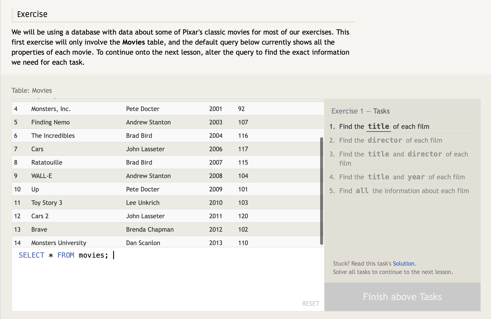

#### `SELECT` queries

 

To retrieve data from a SQL database, you need to write `SELECT` statements which are referred to as **_queries_**. A **_query_** in itself is just a statement which declares what data we are looking for, where to find it in the database, and optionally, how to transform it before it is returned. _IT HAS A SPECIFIC SYNTAX_ to utilize this statement.

Think of a table in SQL as a type of **_entity_** (cars), and each row in that table is a specific **_instance_** of that type (sedan, SUV, sport, different color sedan). This means that the columns would then represent the _common properties_ shared by all **_instances_** of that **_entity_** (type of wheels, different color for the interior, etc).

And given a table of data, the most basic query we could write would be one that `SELECT`s a couple columns (_properties_) of the table with all the rows (_instances_).

Query result: a two-dimensional set of rows and columns, a copy of the table, but only with the columns that was requested.

If wanting to retrieve all the columns of data from a table, you can use the asterisk ( \* ) in place of listing all the columns individually.

---

Answers:

1. `SELECT Title FROM movies;`
2. `SELECT director FROM movies;`
3. `SELECT title, director FROM movies;`
4. `SELECT title, year FROM movies;`
5. `SELECT * FROM movies;`
