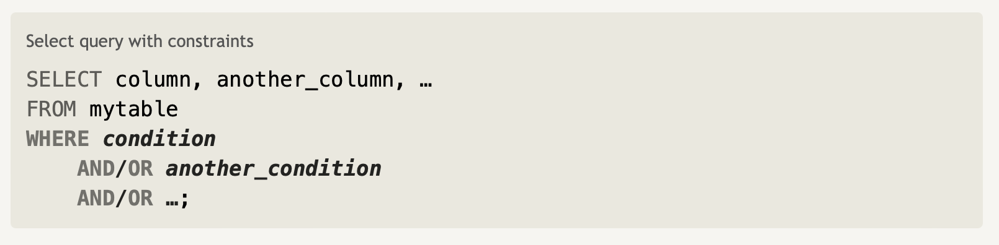

#### SQL Lesson 2: Queries with constraints (Part 1)

First lesson was showing how to `SELECT` columns of data from a table, but what if the database has millions of rows of data?

In order to fitler certain results from being returned, you need to utilize a `WHERE` clause in your query. The clause is applied to each row of data by checking specific columns values to determine whether it should be included in the results or not.

You can construct multiple clauses by joining `AND` or `OR` logical keywords. Below is a list of operators that you can use for numerical data (integer or floating point):

| Operator                        | Condition                                            | SQL Example                     |
| ------------------------------- | ---------------------------------------------------- | ------------------------------- |
| `=`, `!=`, `<`, `<=`, `>`, `>=` | standard numerical operators                         | `col_name != 4`                 |
| `BETWEEN ... AND ...`           | number is within range of two values (inclusive)     | `col_name BETWEEN 1.5 AND 10.5` |
| `NOT BETWEEN .. AND ...`        | number is not within range of two values (inclusive) | `col_name NOT BETWEEN 1 AND 10` |
| `IN (...)`                      | number exists in a list                              | `col_name IN (2,4,6)`           |
| ` NOT IN (...)`                 | number does not exist in a list                      | `col_name NOT IN (1,3,5)`       |

Writing clauses to constrain the set of rows returned also benefits performance due to reduction of unncessary data being returned.

---
