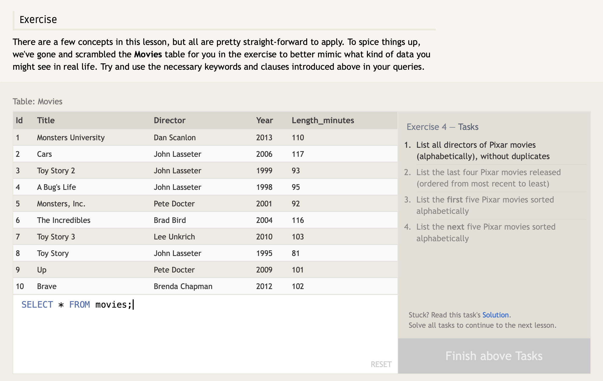

#### SQL Lesson 4: Filtering and Sorting Query results

SQL provides a way to discard rows that have a duplicate column value by using the `DISTINCT` keyword.

`DISTINCT` keyword will blindly remove duplicate rows (**_to discard duplicates based on specific columnsusing grouping and the_** `GROUP BY` **_clause_**).
 

##### Ordering results

Most data in real databases are added in no particular column order. As a result, it can be difficult to read through and understand the results of a query. To sort your results by a given column in ascending or descending order, you will use the `ORDER BY` clause.

When an `ORDER BY` clause is specified, each row is sorted **ALPHA-NUMERICALLY** based on the specified column's value. In some databases, you can also specify a collation to better sort data containing international text.
 

##### Limiting results to a subset

`LIMIT` and `OFFSET` clauses (commonly used with `ORDER BY` clause) indicates the database the subset of the results you care about. The `LIMIT` will reduce the number of rows to return, and the _optional_ `OFFSET` will specify where to begin counting the number rows from.

Using Reddit or Pinterest as an example, the front page is a list of links sorted by popularity and time, and each subsequent page can be represented by sets of links at different offsets in the database. Using these clauses, the database can then execute queries faster and more efficiently by processing and returning only the requested content.

> `LIMIT` and `OFFSET` are generally applied last after the other clauses have been applied.
>  

---

---

Answers:

1. `SELECT DISTINCT director FROM movies ORDER BY director ASC;`
   
    

2. `SELECT * FROM movies ORDER BY year DESC LIMIT 4;`
   
    

3. `SELECT * FROM movies ORDER BY title ASC LIMIT 5;`
   
    

4. `SELECT * FROM movies ORDER BY title ASC LIMIT 5 OFFSET 6;`
   
