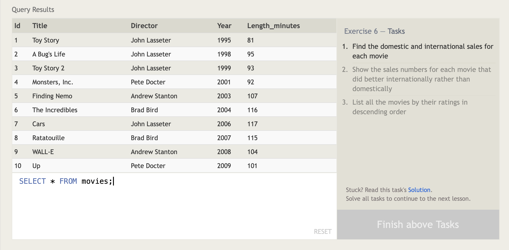

#### SQL Lesson 6: Multi-Table Queries with `JOIN`s

 

**_Normalization_**: process organizing data in a database

_Database normalization_ minimizes duplicate data in any single table and allows for data in the database to grow independently of each other. The trade-off is queries will have to find data in different parts of the database which may come with performance issues.
 

##### Multi-table queries

Tables that share information about a single entity need to have a **_PRIMARY KEY_** that identifies that data **UNIQUELY** across the database. A common primary key type is an _auto-incrementing integer_ (space efficient). Other key types are string and hashed value.

Using `JOIN` clause in a query, it will combine row data across two separate tables.
 

##### USING `INNER JOIN`

It's a process that matches rows from the first and second table that has the same key (**defined by** `ON` **constraint**) to create a result row with combined columns from both tables.

---

##### Answers

1. `SELECT title, domestic_sales, international_sales FROM movies INNER JOIN boxoffice ON movies.id = boxoffice.movie_id`
   
    

2. `SELECT title, domestic_sales, international_sales FROM movies INNER JOIN boxoffice ON movies.id = boxoffice.movie_id WHERE international_sales > domestic_sales`
   
    

3. `SELECT * FROM movies INNER JOIN boxoffice ON movies.id = box.movie_id ORDER BY rating DESC`
   
