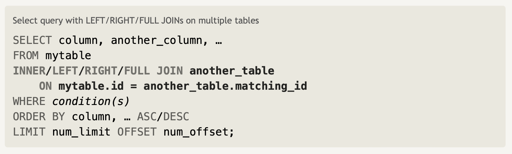
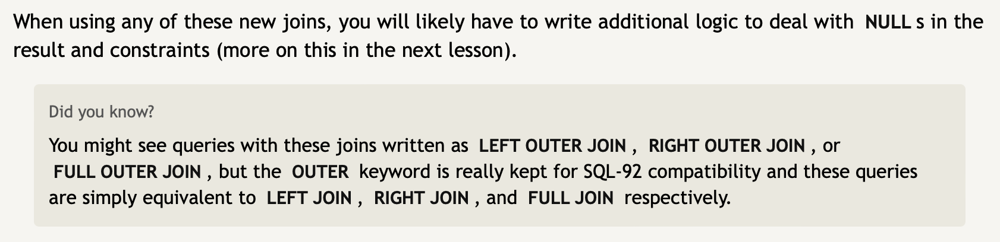

#### SQL Lesson 6: `OUTER JOIN`

 

`INNER JOIN` is sufficient if the resulting table only contains data that belongs in both tables.

If the two tables have asymmetric data then you would have to use `LEFT JOIN`, `RIGHT JOIN`, or `FULL JOIN` to ensure your data is not left out in your results.

`LEFT JOIN`: when joining table A to table B, it will include rows of table A regardless if there are no matching rows in table B.

`RIGHT JOIN`: when joining table A to table B, it will include rows of table B regardless if there are no matching rows in table A.

`FULL JOIN`: this will include all rows from table A and table B regardless rows to match.

