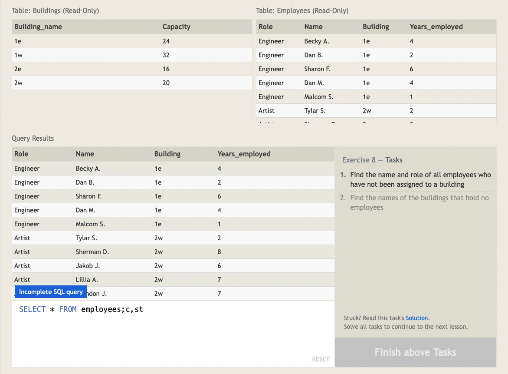

#### SQL Lesson 8: `NULLS`

 

It's always good to reduce the **POSSIBILITY** of `NULL` values in the database because they require special attention when constructing queries, constraints (certain functions behave differently with `NULL` values), and when processing the results.

An alternative is to have **data-type appropriate default values**, like 0 for numerical data, empty strings for text data, etc. But if your database needs to store incomplete data, then `NULL` values can be appropriate if the default values will skew alter analysis (like taking averages of numerical data).

Sometimes, it's not possible to avoid `NULL` values. In these cases, you can test a column for `NULL` values in a `WHERE` clause by using either `IS NULL` OR `IS NOT NULL` constraint.

---

#### Answers

1. `SELECT * FROM employees WHERE building IS NOT NULL;`
   
    

2.
