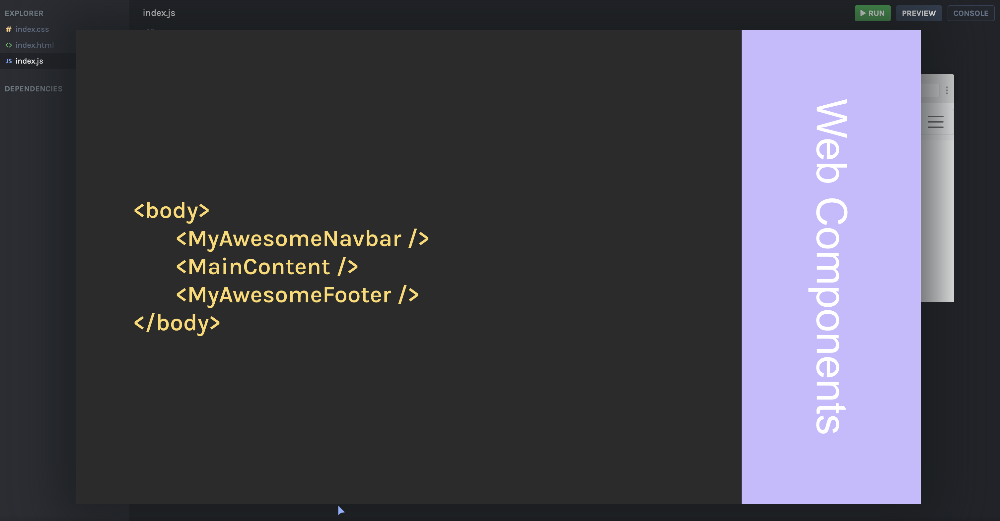
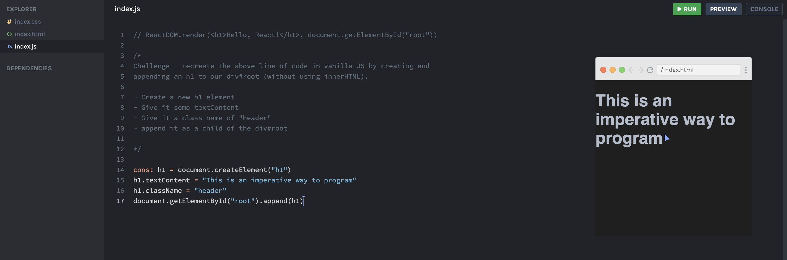
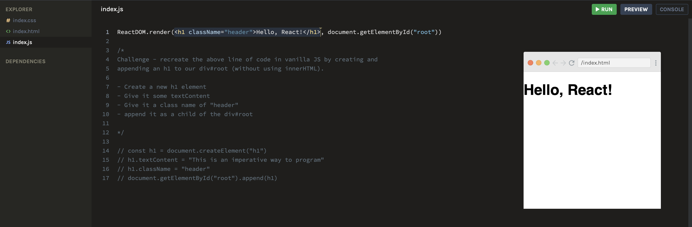

### Why React?

 

##### It's Composable

What is composable code? Think of it as a collection of small pieces of code that work together for the bigger picture or end goal. Example below.

Each component (think of it as a function) will contain code that serves a purpose - whether if it's one function or multiple functions in one. A component can have multiple components within as well.
 

##### It's Declarative

**_Declarative_** ask

> "What should be done?"
> Just tell me what to do, and I'll worry about how I get it done.

**_Imperative_** ask

> "How should it be done?
> Describe to me every step on how to do something, and I'll do it.

Javascript is an example of imperative code where you must give instructions for each step to accomplish a function. Example below:

For React, you're essentially writing your javascript as if it was `html`. You're relying on React to figure out how to turn what was declaratively written into javascript code that is needed to `append` it to the DOM.

