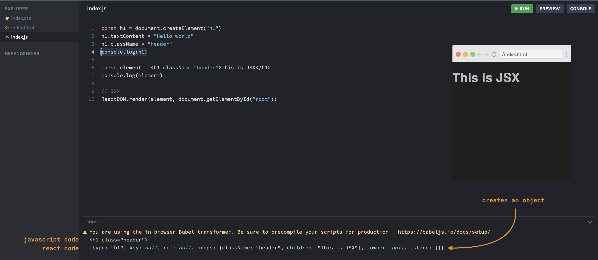
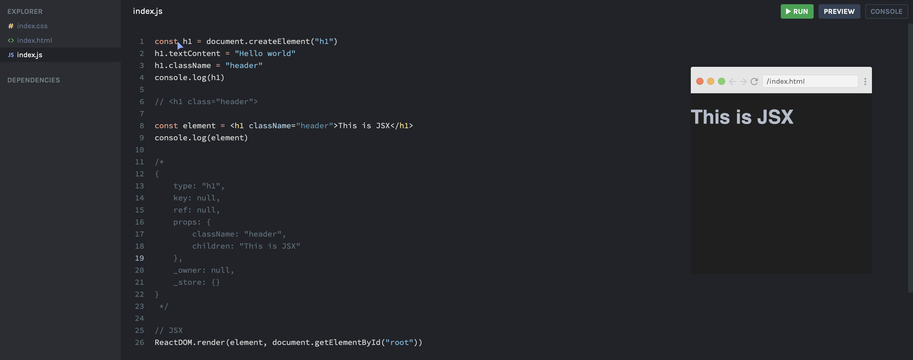
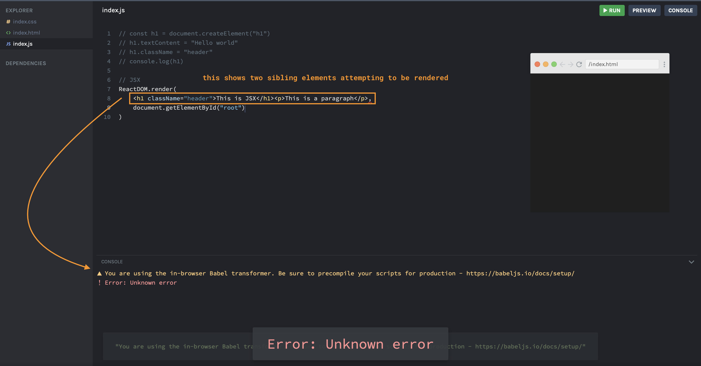
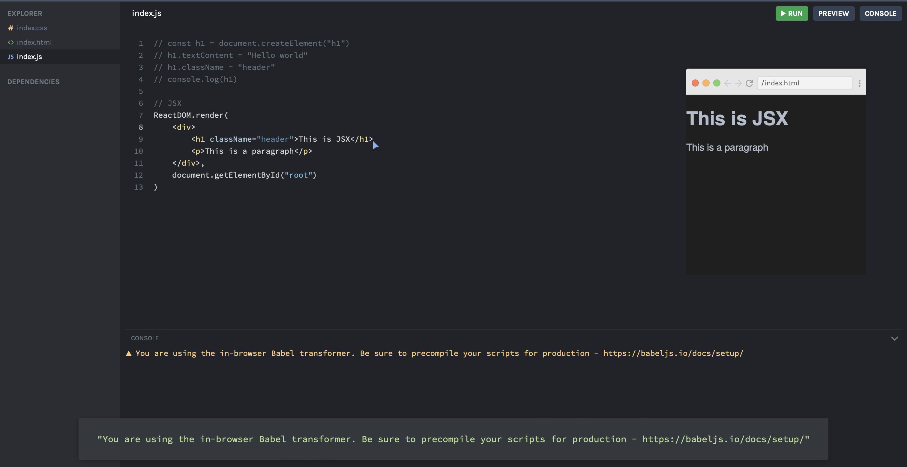

### JSX

> JSX = Javascript XML

The introduction of `JSX` in React is what made it declarative. In the example below, you can see in the javascript code how you must provide each step to create a `<h1>` element in the `html` file. When the React code, you can see that you can write essentially `html` code with just some little caveats.

Now, when you run the code and `console.log` it, you can see the output for both. Running the `console.log` for the `DOM` element that was created by Javascript, creates a `html` element in the console. Running the `console.log` for the `JSX` element, in the console it created a javascript object.

The object describes the `DOM` element we want from React to put on the page. Another way to think of it is that `JSX` is like a function that returns objects that React can interpret and use to create actual elements on the page.

With `JSX`, you need to make sure you are only returning a single parent element. If you attempt to put sibling elements together, you will get an error when running the code.

For the example above, you will need to wrap the sibling elements into a parent element.

