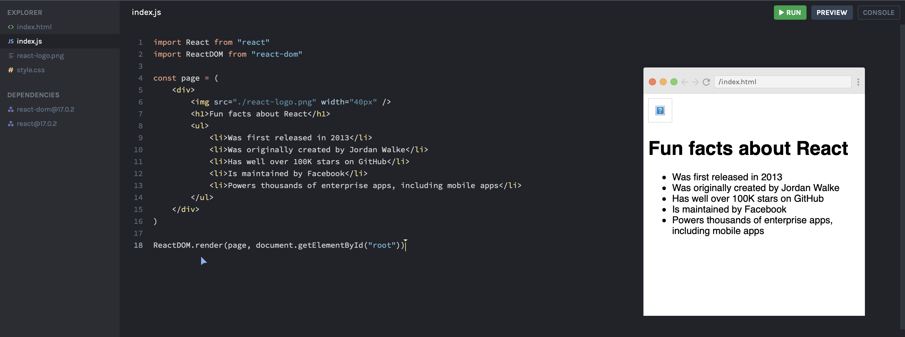
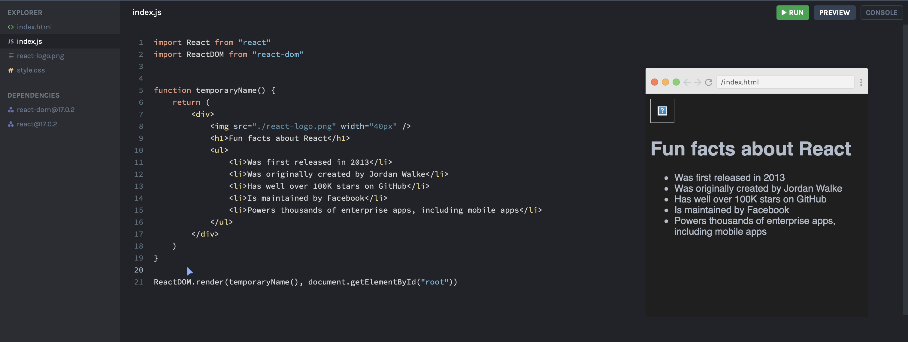
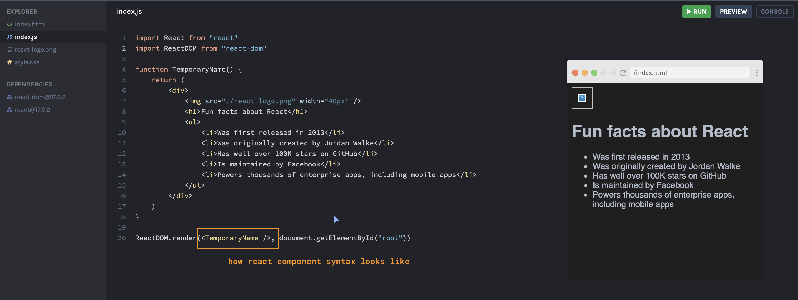

### Custom Components

In the above example, JSX is stored in a variable. The issue with this is that it doesn't allow you any kind of flexibility in React. It's not reuseable and will be hard to maintain in your code.

Now, how can you create reusable code? React components are basically functions. See the example below (still not how you write a component but it's to illustrate the idea of reusable components).

