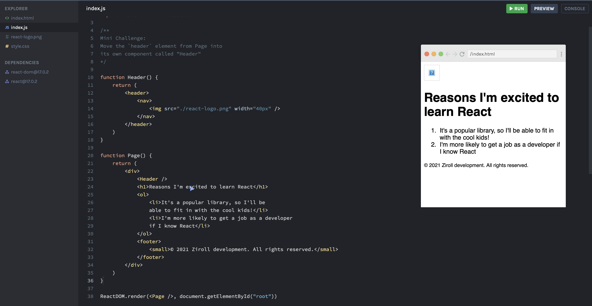
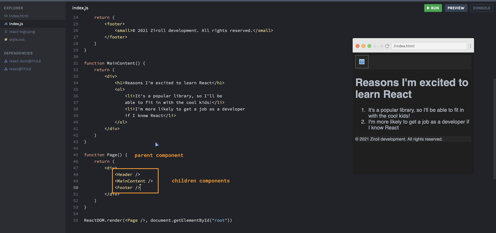

### Custom Components Cont...

#### Quiz!

1. What is a React component?
   A reusable function that returns React elements.
2. What's wrong with this code?
   There is no parent element like `<div>` or `<>`. I was wrong - it's missing the capitalization on the first letter of the function (myComponent > MyComponent).

```
function myComponent() {
    return (
        <small>I'm tiny text!</small>
    )
}
```

3. What's wrong with this code?
   In ReactDOM.render, the first parameter should not be a function but rather `'<Header />'`.

```
function Header() {
    return (
        <header>
            <nav>
                
            </nav>
        </header>
    )
}

ReactDOM.render(Header(), document.getElementById("root"))
```

---

#### Parent/Child Component



The `ReactDOM.render` is creating an instance of the `<Page />` component. The `<Page />` is creating an instance of the `<Header />` in its component as if it is an `HTML` element amongst the rest of the code.

This shows the concept of composibility in practice.

Below example shows more of a parent/children component relationship.


