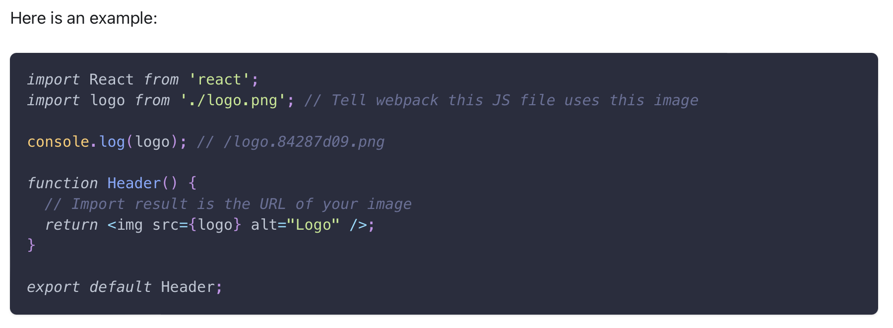

#### Styles and images with CRA

One of the challenges you will face with React is loading styles and images.

The Webpack series that is running `create-react-app` behind the scenes is using a `style loader` that allows you to import the styles directly into your `index.js`. Webpack is going to bundle everything into one javascript file and live near `index.html` found in the public folder. Essentially, you'll end up with `index.html`, `index.css`, and `index.js` files which happens behind the scenes for you.

With webpack, using static assets like images and fonts works similarly to CSS. Unlike CSS imports, importing a file give syou a string value. This ensures that when the project is built, webpack will correctly move the images into the build folder, and provide us with correct paths.

---
