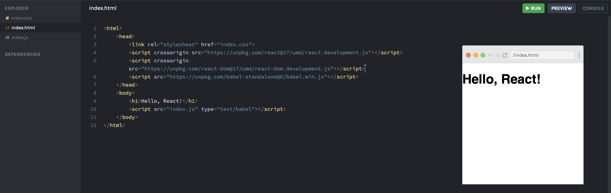
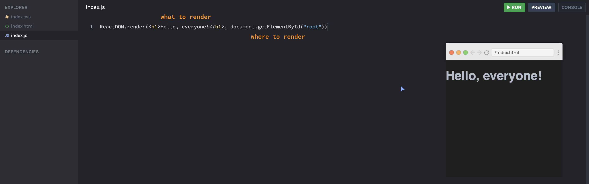
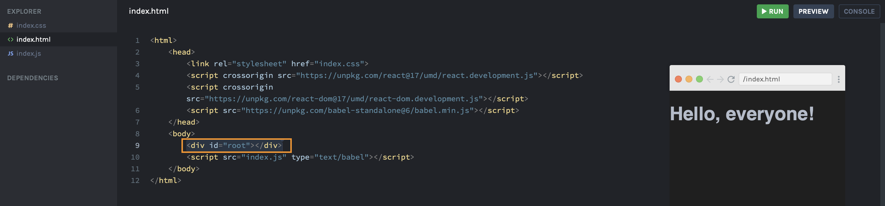

### First React Project

Adding these React `<script>` allows the dev to start using the React library for their project via CDN.

The first `<script>` pulls in the react library and the second `<script>` is react dom, but just these two scripts are very limited to utilize React itself. `ReactDOM` is a script that renders everything on the screen. To use it fully, you need to pull in the `<script>` for Babel.

This will allow you to use JSX in any `<script>` tag by adding `type="text/babel"`

You can use `ReactDOM` script gives you access to the global variable, `ReactDOM`, in the javascript file which will render something on the screen. This will render code that looks like `html`.
 

#### Example:

A basically template that has the 3 `<script>` tags from above (2 that pulls the React library and renders your code; last one that allows you to use JSX). In the example, you can see the `<h1>` tag that says "Hello, React".

To show how `ReactDOM` can render your code, you'll remove the `<h1>` tag in the `html` file and put it in the javascript file using `ReactDOM`. This will showcase how React can help create declarative code.
 

##### How ReactDOM

`ReactDOM` has two parameters - what do you want to render onto the screen, and where do you want to render it.

In the example above, we remove the `<h1>` tag from the `html` file and replace it with a `
`. The `ReactDOM` code in the javascript file will utilize this `
` tag and inject the code onto the `html` file.

Now you create a `"Hello World"` project with a single line of React code injected into a `DOM` element in the `html` file with javascript.

> `ReactDOM.render(<h1>Hello</h1>, document.getElementById('root'))`

`ReactDOM`: this is a global variable
`.render`: a render method that will place something on the screen
`<h1>Hello</h1>`: this is the element you want to place into the file
`document.getElementById('root')`: a `DOM` node where you want the element to be placed in

The `.render` method is taking the `DOM` element and running it similar to `.append` or `.appendChild` methods. It's appending the element for the first parameter.

> _I'm repeating myself here, but I want to make sure I can think of it in different ways to understand it._
