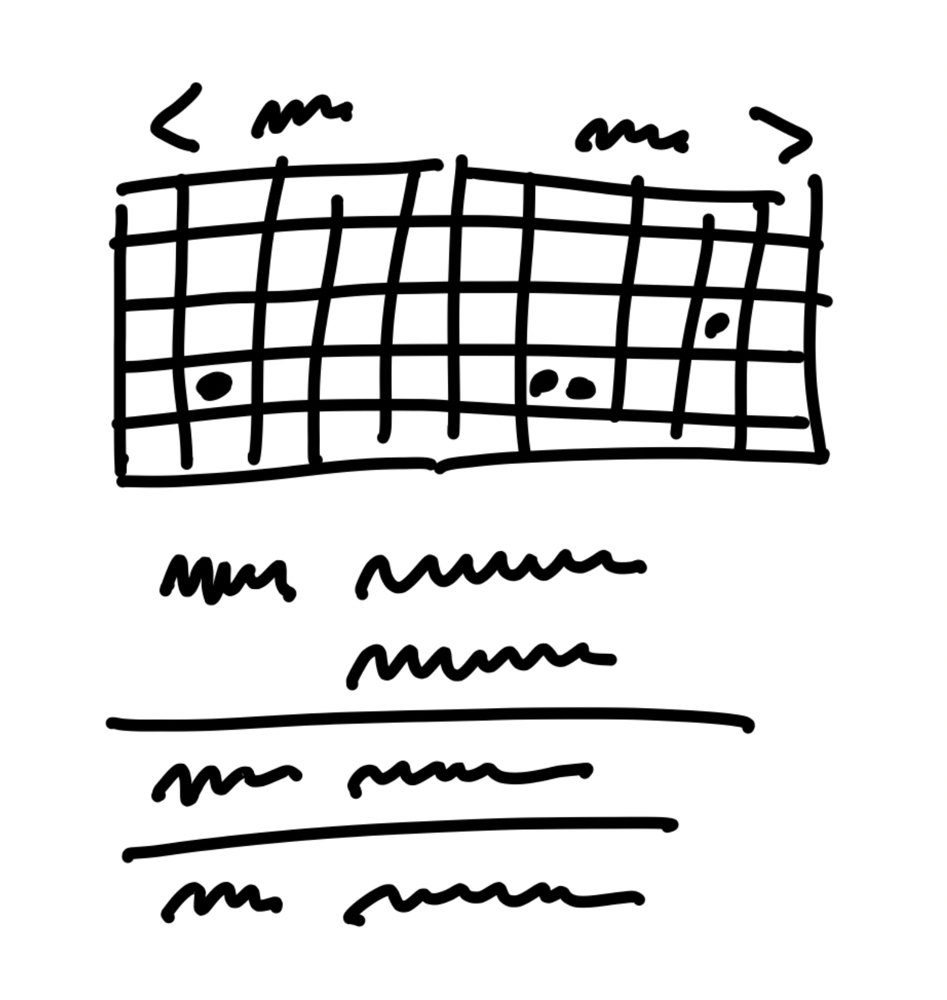
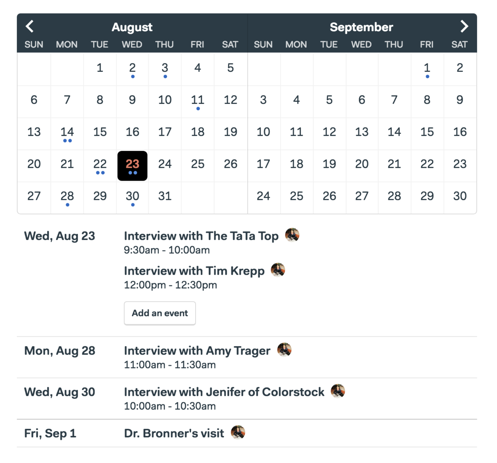

### Principles of Shaping

 

#### Wireframes Are Too Concrete

When design leaders go straight to wireframes or high-fidelity mockups, they define too much details too early. This leaves your designers no room for creativity.

**_Over-specifiying the design leads to estimation errors_**.

The more specific the work is, the harder the estimate can be. That's because making the interface just so can required hidden complexities and implementation details that weren't visible during the mockup. **When the scope is not variable, the team cannot reconsider a design decision that is turning out more costly than originally planned**.
 

#### Words Are Too Abstract

Projects also cannot be too vague. Team members don't have enough information to make trade-offs. They won't know what to include or leave out. This will leave a concerning issue with estimations for a project.

#### Case Study: The Dot Grid Calendar

This excerpt is going to be an example of not providing too much details on a calendar and providing a better discovery of the key elements needed for this project. This is all about giving the right amount of details of what needs to be accomplished and room for designers to be creative in the solution.

Customer request a calendar to be implemented. Calendars can take six months or more to build a proper calendar.

Here are the things that can make a calendar complicated:

- dragging and dropping events between cells to move them
- wrapping multi-day events around the edge of the screen
- different views of monthly, weekly, or daily time scales
- dragging the edge of an event to change its duration
- color coding events for different categories
- handling different expectations for desktop vs mobile interactions

Estimating all the different features needed for a proper calendar, you can only accomplish a tenth of the requests to fit in a six week cycle. Now, you have to decide which tenth you need to accomplish. The narrowed use case for this example led to making a calendar similar to a mobile phone calendar.

You can build a two-month, read-only grid view calendar. Any day with an event will have a dot for each event. A list of events will appear below the calendar and clicking on a day with events will scroll the events for that day into view. This is essentially not a fully-featured calendar.

**_The sketch shows minimal details of what needs to be accomplished. This leaves room for the designer to intepret how it should look. This specifies what the feature needs to do and what it should look like._**

 

#### Property 1: It's Rough

Working in the shaping stage is rough. It should look unfinished, but it leaves open room for contributions from the designers and programmers. They can apply their own judgment and expertise to discover trade-offs that emerge.
 

#### Property 2: It's Solved

Despite the rough sketch is unfinished, it is thought through.

**It has all the main elements of the solution at the macro level and how they connect together**.

The work isn't specified to individual tasks, but has the overall solution to the project. While there will be surprises found throughout the process, it still gives a clear view of the direction of what needs to be accomplished. Any open questions or rabbit holes we could see up front have been removed to reduce the project's rish.
 

#### Property 3: It's Bounded

Lastly, shaped work indicates what **_not_** to do. It tells the team where to stop. Completing the project within a fixed amount of time - six weeks - requires limiting the scope and leaving specific things out.

The roughness leaves room for the team to resolve the details, while the solutions and boundaries act as guard rails.
 

#### Who Shapes

Shaping requires a combination of interface ideas, technical possibilities, and business priorities. To accomplish this goal, either be a generalist or collarborate with one or two people.

This is about design work. The shaped concept is an interaction design view from a user's perspective. It defines what the feature does, how it works, and how it fits into existing flow. Knowledge of how the system will always help see obstacles or opportunities to implement an idea.

Questions to ask:

- what are we trying to solve?
- why does it matter?
- what counts as success?
- which customers are affected?
- what is the cost of doing this instead of something else?

This should be a closed-door process and it should be fast. Jumping from one position to the next promising one.
 

#### Two Tracks

You can't schedule shaping work because its work is risky and unknown, but there are two separate tracks that can be taken:

1. Shaping
2. Building

During any part of the six week sprint, the teams are building work that has been previously shaped and the shapers are building potential features for a future cycle.

Work on the shaping part is kept private and not shared until commitment has been made. This gives the shaping team the option to put work-in-progress in the backlog or drop it if it is not working out.
 

#### Steps to Shaping

1. **_Set boundaries._** First, figure out how much time the raw idea is worth and how to define the problem. This creates a basic boundary.
2. **_Rough out the elements._** Sketching out the solution. This is a high level abstraction rather than wireframes in order to move fast and allow wide range of possibilities. The outcome is solving the problem without the details.
3. **_Address risks and rabbit hole._** Once a solution is defined then you must seek out the holes or unanswered questions that could lead to problems. Amend the solution, cut things out, or specify certain details at tricky spots to prevent the team from getting stuck out or wasting time.
4. **_Write the pitch._** Once everything is shaped, then you write up a formal `pitch`. This will summaries problem, constraints, solutions, rabbit holes, and limitations. The pitch goes into a `betting table` for consideration. Once the project is picked, then it can be presented to explain the project to the team.
