### Find The Elements

 

#### Move At The Right Speed

Two things enables you to move at the right speed in this stage.

1. Having the right people - or nobody - in the room.
2. Avoiding the wrong level of details in drawings and sketching.

If you start with wireframes or specific visual layouts, you'll get stuck int he details and prevent yourself in exploring broadly. The challenge is being concrete enough to progress forward without finer details to derail it.

**Questions to ask:**

- where is in the current system does this new thing fit?
- how do you get to it?
- what are the key components or interactions?
- where does it take you?

---

#### Breadboarding

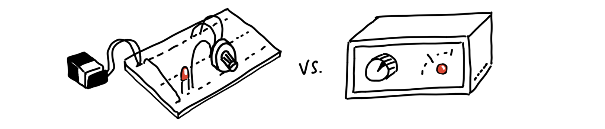

A breadboard is an electrical engineering prototype that has all the components and wiring of a real device but no industrial design. Deciding to include an indicator light and a rotary knob is very different from debating the chassis material. Discuss the key components and connections of an interface idea without specifying a particular visual design. Here are the three things to discuss:

1. Places - things you navigate to like screens, dialogs, and menus
2. Affordances - interactive; things such as buttons, fields, interface copy; reading interface copy is an act that gives the user info for subsequent actions
3. Connection lines - shows how the affordance takes the user from one place to another

The important things are the components we’re identifying and their connections. They allow us to play out an idea and judge if the sequence of actions serves the use case we’re trying to solve.
 

##### Example

A product is an invoicing tool and we want to add an 'autopay' feature which will allow users to pay automatically to future invoices.

Questions to ask:

- how do you turn on autopay?
- what's involved?

For this example, the starting point is the customer landing on the invoice page. Start by writing down the name of the place and underlining it.

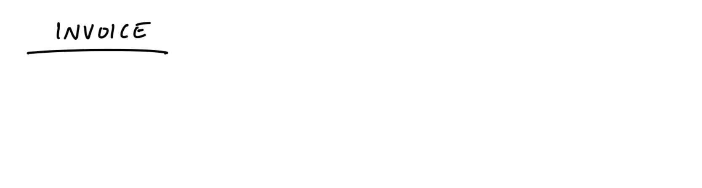

On the invoice, we’re thinking we could add a new button to “Turn on Autopay.” That’s an affordance. Affordances go below the line to indicate they can be found at that place.

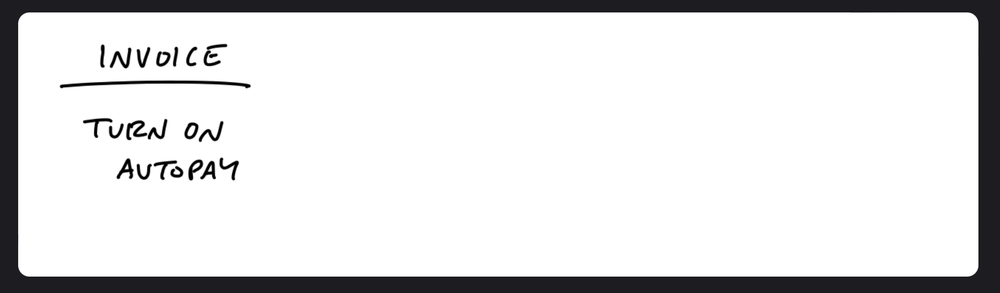

Where does that button go? Some place for setting up the Autopay. We don’t have to specify whether it’s a separate screen or a pop up modal or what. From a what’s-connected-to-what standpoint (the topology) it’s all the same. Let’s draw a connection line from the button to the Setup Autopay screen.

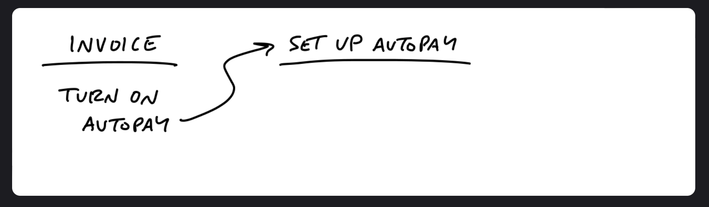

Next is discussing what belongs on the screen. Questions you can ask:

- do we ask for a credit card here?
- is there a card on the file already?
- what about ACH or other payment methods?

Asking questions like these will lead to debates and discussions about what to build just for this one topic. For this example, you decided to focus on credit card details.

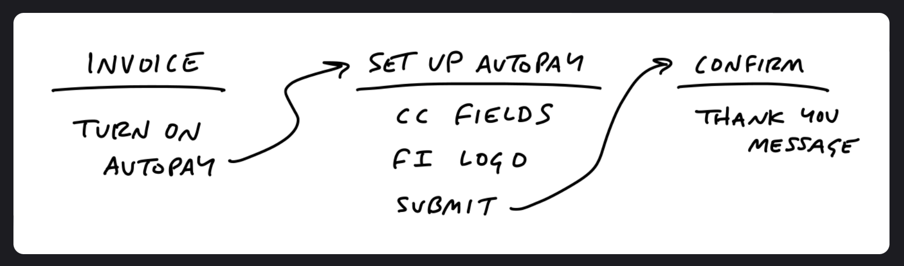

Next questions to ask is - **did the user pay the original invoice?** Now you have both functional and interface questions.

- what does enabling autopay actually do?
- does it only apply for future payments?
- or does paying with autopay the first time also includes the current invoice?
- and where do you explain this behavior?

You can see how this will lead to deeper brainstorming. Because you are not bound to detailed wireframes or mockups, you can jump around and entertain different possibilities. In this example, we'll add another option in the Setup page.

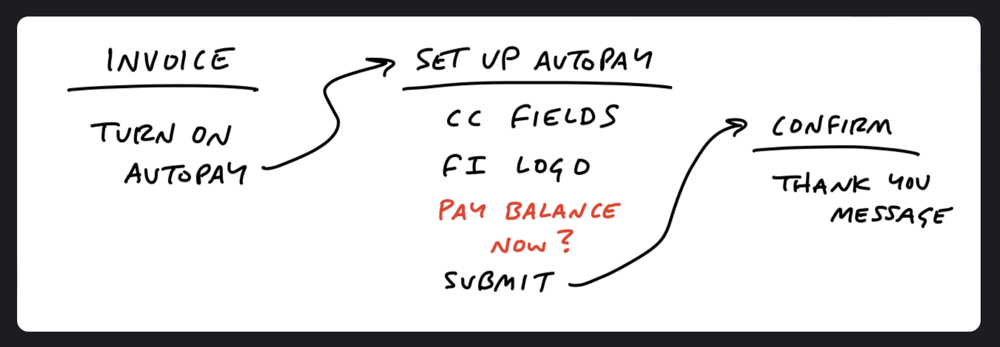

Adding a pay-now option adds some complications on the confirmation page. If the user selects the pay-now option then you will need to show a receipt. Now, you have to ask:

- should the confirmation page have a condition that shows a receipt at times?
   

##### Different Approach

Instead of starting auto-pay on the invoice page, add it as an option on the new pay-now page (former auto-pay setup page). The invoice page (first page) will have the pay option instead. This will help with not leading a question for the user if the current amount needs to be paid. You can also add an extra auto-pay callout to the existing confirmation page.

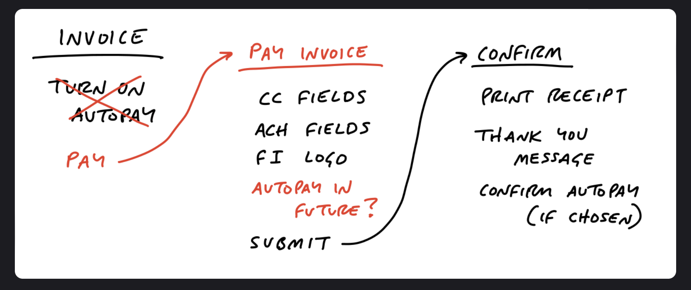

This sketch reminds you that the current payment form supports ACH **(Automated Clearing House - a payment processing network that's used to send money electronically between banks in the United States. It allows for automated, electronic debiting and crediting of both checking and savings accounts)** in addition to credit cards.
 

##### Turning Off Auto-Pay

After auto-pay is turned off, how will a user turn it off? Up to this point in the example, users did not have a username and password. They only followed tokenized links to pay for invoices one by one. So now, let's assume the user has a profile in the system. They will need a username, password, and a landing page to access the auto-pay option to manage it.

So, let's say the team decided that adding a username/password flow will be too much for the scope at this time. The alternative approach would be if the invoicer's users request the invoicer to turn OFF auto-pay for them. With this approach, you can add a single option to disable auto-pay on the customer's detail page that is already offered to the invoicers.

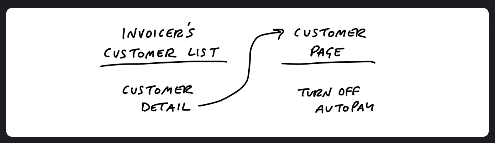

These examples illustrates the level of thinking and speed of movement to aim during the breadboarding phase. Writing out the flows presents you questions you haven't thought about previously and stimulates new ideas without being distracted by unimportant visual choices.

Once you to get a place where you went through the use case and flow that fits, you got the main elements needed to start defining the project more clearly. Basically, getting more concrete while still leaving out a huge amount of details.

---

#### Fat Marker Sketches

Somtimes the idea might be a visual due to 2d arrangement of elements so utilizing the breadboarding approach may not work. Using a fat marker sketch, rather than wireframing or mock-ups, would be the better approach.

It's a sketch that prevents you from adding details.
 

##### Example

Creating a fake to-dos in a to-do list that is acting like divider in the list. Entering "--- needs testing ---" as the to-do then putting items below it.

_The idea: make an official divider feature in our to-do tool to turn the workaround into a first class function of to-do lists._

You need to work out the implications of adding a divider.

_The rough idea: adding a divider separates the list from "loose" to-do items above the divider and "grouped" the to-do items below the divider; adding subsequent dividers adds more groups below the "loose" to-do items at top._

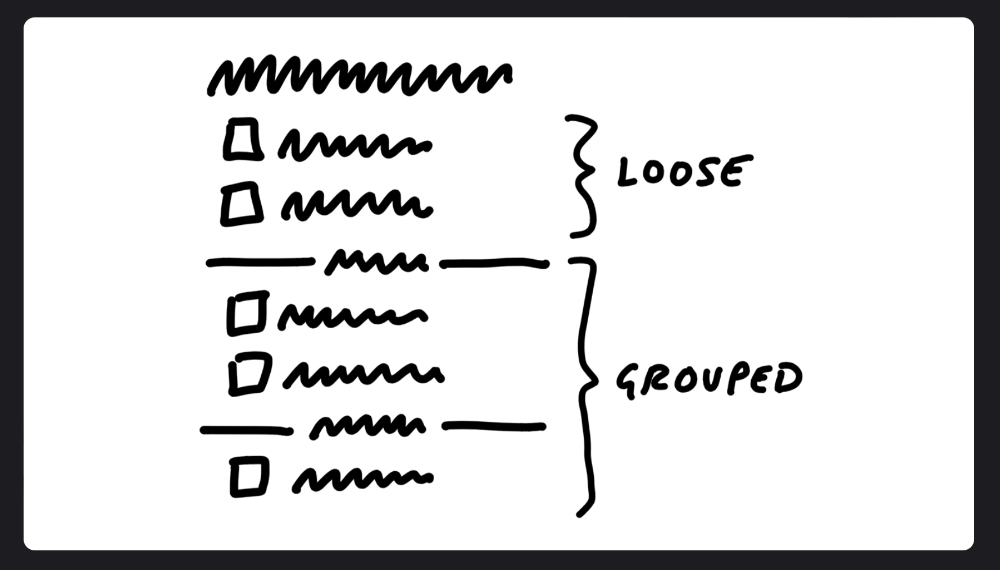

Add some affordance items within each group, including the "loose" group on top.

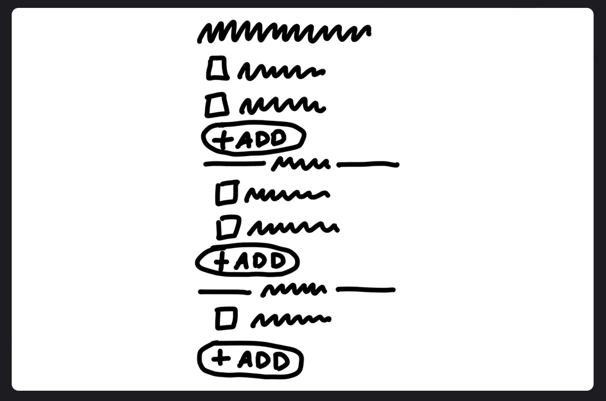

With this affordance, the add buttons will break up the gestalt of the list and the groups might separate too much from the lists on the page. Alternative approach: placing the "add" affordance to the existing menu on the left.

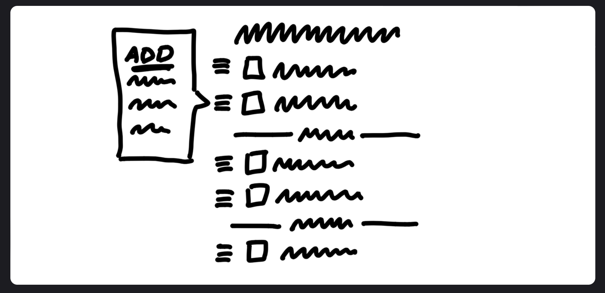

This sketch is less constraining than breadboarding, but comes with some downsides. Having a sketch might make you feel attach to a layout element even though it's not a core element. This is still a better option than creating wireframes too early.

The reason for utilizing fat marker sketches is we too easily skip ahead to the wrong level of fidelity. Creating a rough sketch helps to segment the creative process and aren’t jumping ahead to detail a specific idea when we haven’t surveyed the field enough.

---

#### Elements Are The Output

For the Autopay example, here are some elements that were identified:

- a new “use this to Autopay?” checkbox on the existing “Pay an invoice” screen
- a “disable Autopay” option on the invoicer’s side

For the To-Do Groups example, the elements were:

- loose to-dos above the first group belong directly to the parent
- grouped to-dos appear below the loose to-dos
- attempting to have an "add" affordance within each section, but if that doesn’t work visually, being ok with relying on the action menu for inserting to-dos with the add affordance

Using the fat marker approach, you can simplify the solutions for rendering events on a calendar grid.

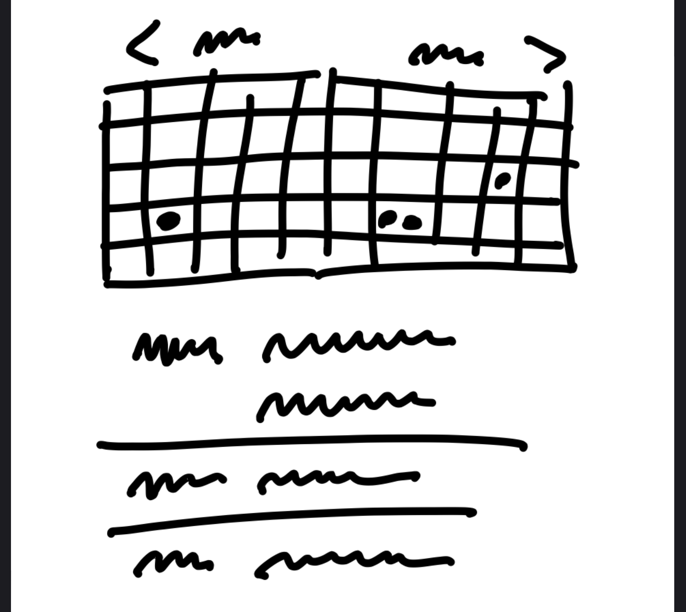

The main elements that you can identify are:

- a 2-up monthly calendar grid
- dots for events, no spanned pills
- agenda-style list of events below that scrolls an event into view when you tap a dot

This list of elements is extremely narrow and specific compared to “monthly calendar.” Exactly the kind of narrowing we hope to accomplish through the shaping process.

---

#### Room For Designers

When it is time to involve designers, any specific mockups are going to bias what other people do after you. They'll take every detail in the initial mockups as direction even though you didn't intend it to.

Working at the right level of abstraction not only ensures we move at the right speed, it also leaves room for creativity in later stages.

This is the theme of the shaping process. You're making project more specific and concrete, but leaving room for decisions and choices to be made later. This isn't a spec. It's creating boundaries and rules while allowing different ways to accomplish the goal.

---

#### Not Deliverable Yet

You formulated a rough idea to now a specific approach with a some concrete elements, but it is still mostly an outline. What you have accomplished is found an approach for how to solve the problem, but there may be some unknowns that still need to be address before handing it off to your team to build.

Your next step is to do some stress-testing and de-risking. You want to check for holes and challenges that could hinder the project from shipping within a fixed time (sprints).

---

#### No Conveyor Belt

At this stage, you can still walk away from the project. No commitments have been made yet. What you have completed is added value to the raw idea by making it actionable. This gets you closer to a good option that you can later lobby for when it's time to allocate resources.
