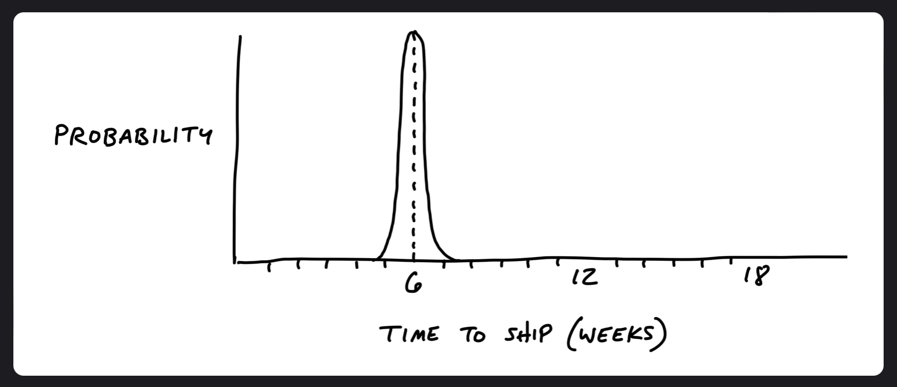
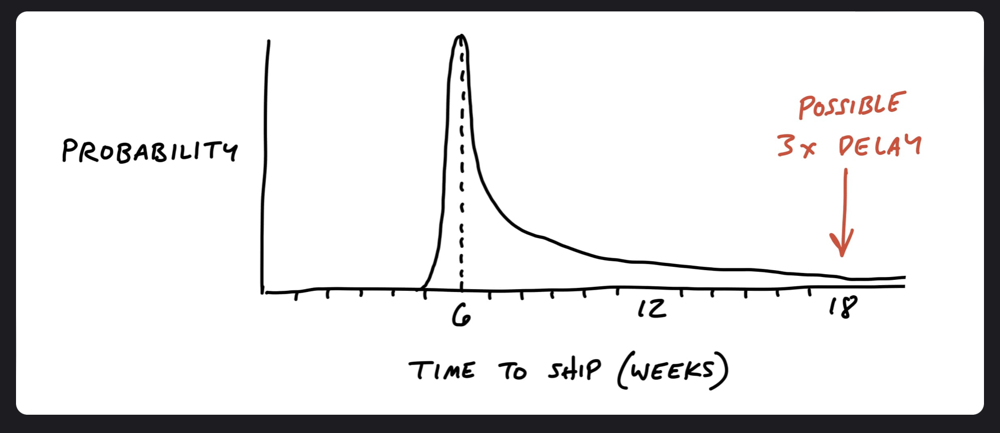
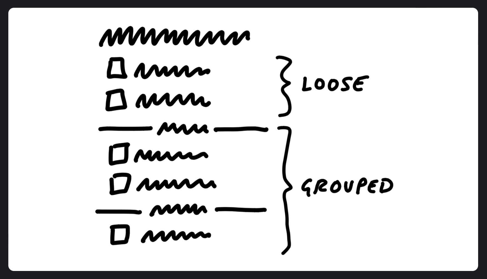
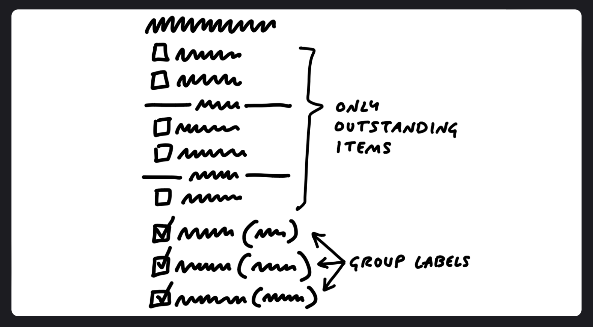

### Risks And Rabbit Holes

First thing to remember is that you are shaping work for a finite window of time - a buildable work within a timeframe (sprint) - but it only takes one hole to derail the concept. If your team run into an unanticipated problem that takes two weeks to solve, then you just burned a third of your budget.

Sometimes you run into problems that don't delay the project, but they have no solution. For example, redesigning a project and assume the designer would figure it out meaning no shaping phase to validate that a viable approach exist. You may not find a suitable solution within the sprint and end up abandoning the project and having to rethink it later.

There will always be unknowns. Thus why applying the right principles will tackle the right problems in the right order, leaving room for the unexpected. Find the pitfalls upfront and eliminate them before pushing forward on a project. A shaped project should be free of holes as possible.

---

#### Different Categories Of Risk

In terms of risk, well-shaped work looks like a thin-tailed probability distribution. There's a slight chance it could take an extra week, but the solutions are defined enough that there is no reason it should go beyond that.

However, if there are any holes in the shaping - technical unknowns, unresolved design problems, misunderstood interdependencies - the project will multiply the amount of time to complete.

---

#### Look For Rabbit Holes

In the first part of the shaping process when fleshing out the elements, that was a fast-moving, exploratory process - more breadth than depth. In this step, you're taking a slower approach with a more critical look at what you came up with and identify anything you missed or made technical assumptions that weren't fair.

One solution would be to walk slowly through a use case. How would a user get from the starting point to the end? Slowing down and playing it out could reveal gaps or missing pieces needed to design.

Next, you should question the viability of each part you think you solved.

- does this require new technical work you've never done before?
- are you making assumptions about how the parts fit together?
- are you assuming a design solution exists that you couldn't come up with yourself?
- Is there a hard decision you should settle in advance so it doesn't trip up the exam?

---

#### Case Study: Patching A Hole

Using the same example again with introducing the dividers in the to-do list:

One thing that wasn't addressed was how to display completed items. In the pre-existing design, the latest few completed items displayed below the list. Questions to ask:

- Should we now render completed items at the bottom of each group instead of the list?
- Should we continue to show completed items at the bottom, and repeat the same set of dividers within the completed items section?
- Should we reconsider how we handle completed items entirely?

This is a hole in the concept. If you don't address it then you will push a deep design problem down to your team and ask them to find a solution under a deadline.

**_It's not responsible to give your team a tangled knot of interdependencies and then ask them to untangle it within a short fixed time window._**

Complicated problems can affect the user experience, navigation, and performance. To remove uncertainty in a project, dictate a solution in the shaped concept.

For this example, you would leave the completed items exactly as they worked previously. Instead of grouping them, you would just append the name of the group to each completed item. This tradeoff simplified the problem by still showing the completed items from a group on the group's detail page.

This kind of trade-off would have been much more difficult under a time constraint. There are lots of reasons why a different design or a deeper reconsideration of completed to-dos would be objectively better. Why not try rendering them inside each group? A designer could reasonably think that if they experiment with the styling more than they can make it blend better. Now, they have wasted a few days in the sprint going down a dead end.
