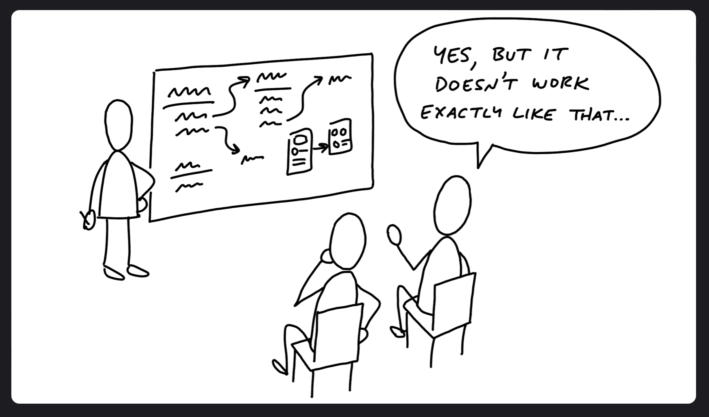

### Risks And Rabbit Holes

First thing to remember is that you are shaping work for a finite window of time - a buildable work within a timeframe (sprint) - but it only takes one hole to derail the concept. If your team run into an unanticipated problem that takes two weeks to solve, then you just burned a third of your budget.

Sometimes you run into problems that don't delay the project, but they have no solution. For example, redesigning a project and assume the designer would figure it out meaning no shaping phase to validate that a viable approach exist. You may not find a suitable solution within the sprint and end up abandoning the project and having to rethink it later.

There will always be unknowns. Thus why applying the right principles will tackle the right problems in the right order, leaving room for the unexpected. Find the pitfalls upfront and eliminate them before pushing forward on a project. A shaped project should be free of holes as possible.

---

#### Different Categories Of Risk

In terms of risk, well-shaped work looks like a thin-tailed probability distribution. There's a slight chance it could take an extra week, but the solutions are defined enough that there is no reason it should go beyond that.

However, if there are any holes in the shaping - technical unknowns, unresolved design problems, misunderstood interdependencies - the project will multiply the amount of time to complete.

---

#### Look For Rabbit Holes

In the first part of the shaping process when fleshing out the elements, that was a fast-moving, exploratory process - more breadth than depth. In this step, you're taking a slower approach with a more critical look at what you came up with and identify anything you missed or made technical assumptions that weren't fair.

One solution would be to walk slowly through a use case. How would a user get from the starting point to the end? Slowing down and playing it out could reveal gaps or missing pieces needed to design.

Next, you should question the viability of each part you think you solved.

- does this require new technical work you've never done before?
- are you making assumptions about how the parts fit together?
- are you assuming a design solution exists that you couldn't come up with yourself?
- Is there a hard decision you should settle in advance so it doesn't trip up the exam?

---
