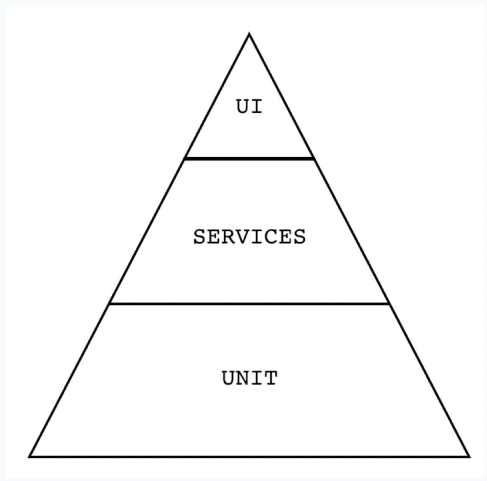

### Designing for Test Automatability

#### Test Automation Pyramid

 

#### Unit Level

At this level, you're designing automated tests close to production code which will provide _faster feedback_. These tests are called **unit tests**. The bulk of your automated tests will be written here and best written by developers as part of their feature development work (doesn't always happen).

**Unit tests** are quick to write and execute. These are small modular test that **_verify the logic of individual functions without the need for integration_** of other functionality, DBs, or UI.
 

#### Services Level

Tests will focus on functionality that the code provides, but without a UI. These tests will make calls to APIs to verify integration of various individual functions. This will contain the second largest of automated tests.
 

#### UI Level

Furthest away from production code, tests will take longer to write and execute due to UI consistency. When considering a test here, determine what info the test needs to verify and choose the lowest level of the pyramid possible to write the test against.
