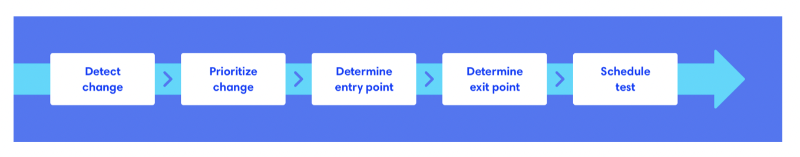

### Measuring Test Automation Value

 

#### Shortened Regression Testing Time

One key benefit for automation testing is reducing time to execute regression testing. Before starting your test automation initiative, make note of how long it takes to execute regression testing manually.

As your test automation matures, the less time it should take to run regression testing. To ensure that addition tests do not add to the overall execution time, you can set a service level agreement (_SLA_) for max amount of time the test suite can take to execute.
 

##### Additional Note:

**_Regression testing_** is a software testing practice that ensures an app still functions as expected after code changes/updates/improvments. _This is the final test to verify the product behaviors as a whole_. **Responsible for stability and functionality of existing features**. It guarantees that after each update, the system stays sustainable under continuous improvements.

Product teams can receive more informative feedback and respond quickly. It detects bugs early in deployment cycle which reduces cost and maintenance efforts to resolve built-up defects.

Regression testing is applied under these circumstances:

- new requirement was added to an existing feature
- new feature or functionality was added
- codebase was fixed to solve defects
- source code was optimized to improve performance
- patch fixes were added
- changes in configuration

**A few basic steps for regression testing are:**

1. **Detect changes in source code** - detect mods and optimizations in source code then identify components or modules that were changed and their impact on existing features.
2. **Prioritize changes and product requirements** - to streamline the testing process with corresponding test cases and tools.
3. **Determine entry point and entry criteria** - ensure whether your app meets preset eligibility before regression test execution.
4. **Determine exit point** - determine a final point or exit for quired eligibility or minimum conditions set in step 3.
5. **Schedule tests** - identify all test components and schedule appropriate time to execute.
    

#### Fast and Frequent Feedback

By automating your regression tests, the team is able to receive feedback as often as needed. The faster the feedback, the less expensive it is to resolve any issues found.
 

#### Faster Development Time

Developers can develop faster when they can trust your automation tests to keep them accountable.
 

#### Scalability

Tracking the ability to scale your tests to different environments, browsers, and devices is valuable.
