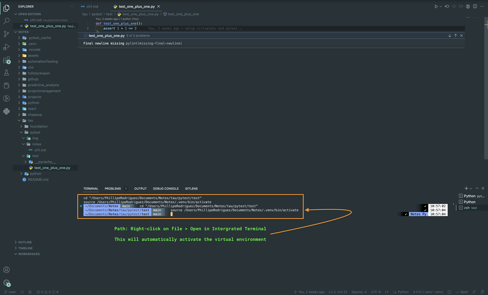
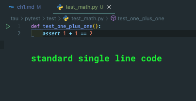
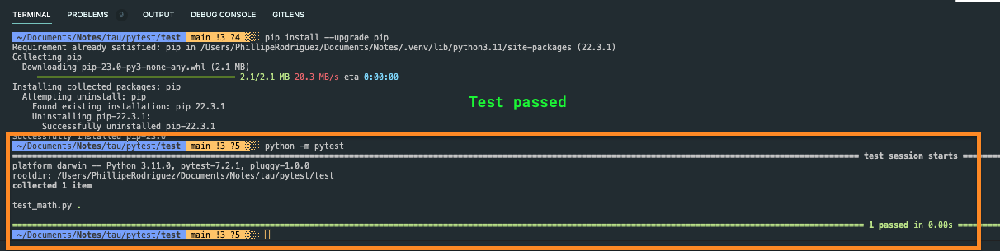

### Chapter 1: Pytest

 

##### Virtual Environment

 

##### First Test Case

1. Python files are called modules because they contain code that is executed directly or imported by other files.
2. Pytest test cases are written as functions while other frameworks structure theirs as classes. This allows `pytest` test cases to be more simpler and concise.
3. Naming conventions are important to `pytest`. The prefix `test_` must be present in both modules and functions. The prefix `test_` for modules created a `_pycache_` folder once saved.
4. You can also put non-test functions inside test modules.
5. _Side note_: Finally was able to install `pip` and `pytest` into virtual environment. 
6. `assert` statements: evaluates a boolean condition and raises an exception of type `AssertionError` if the condition is false. 
7. When you execute your tests, `pytest` will print a banner, list test modules as they run and print a '.' for each passing test case `test_math.py .`, then conclude the test results summary.  

 
