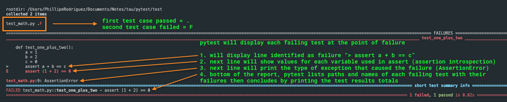

### Chapter 2: Failing Test Case

##### Second Test Case

1. Adding a second test case that will fail within the same module `test_math.py`.

2. When a test fails, it will list the following:
   - First, `.` for passing tests, `F` for failing tests.
   - Second, code snippet of each failing test case at point of failure.
   - Third, shows values of each variable used in assertion called **assertion introspection** (for this example).
   - Fourth, prints the type of exception that caused failures (`AssertionError` for this example); this will help to determine if it is a legitimate defects or automation bugs.
   - Fifth, a `short test summary info` section that lists paths and names of each failing test with their failures.
   - Sixth, print the test results total.

 

3. Fixing the failing test case.
   - Pytest will now show two passing test cases `test_math.py ..`

