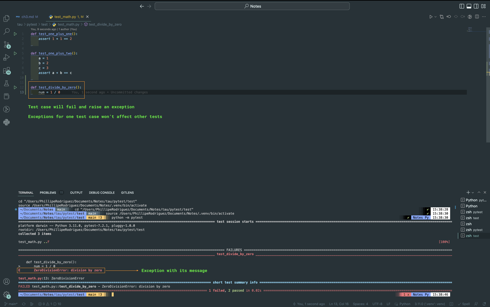
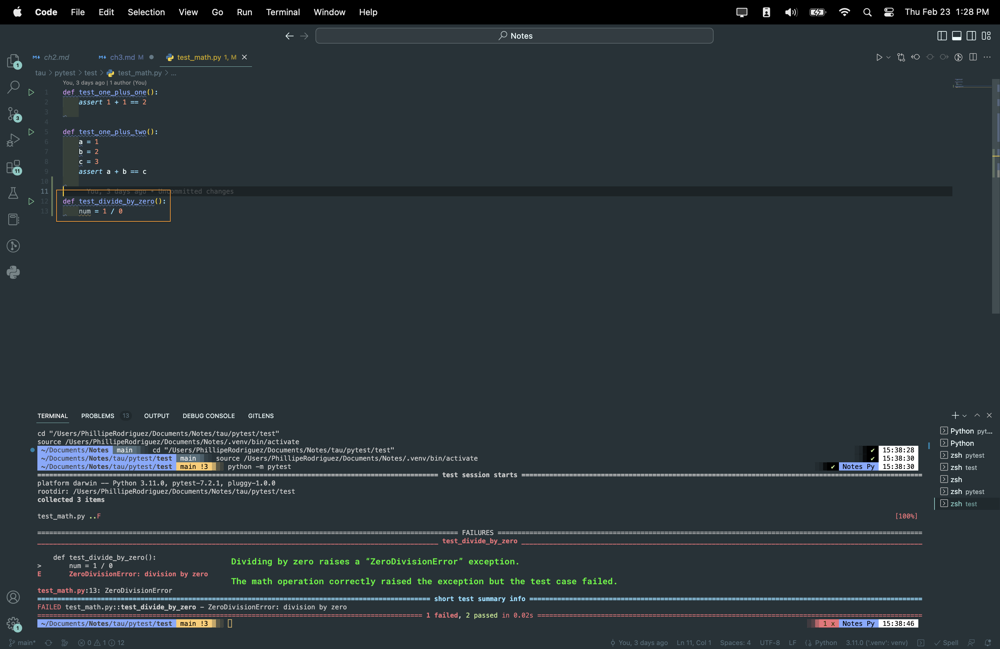
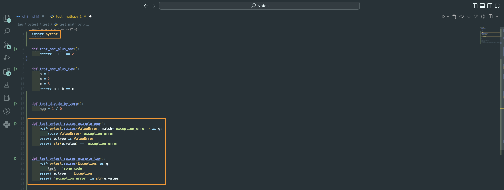
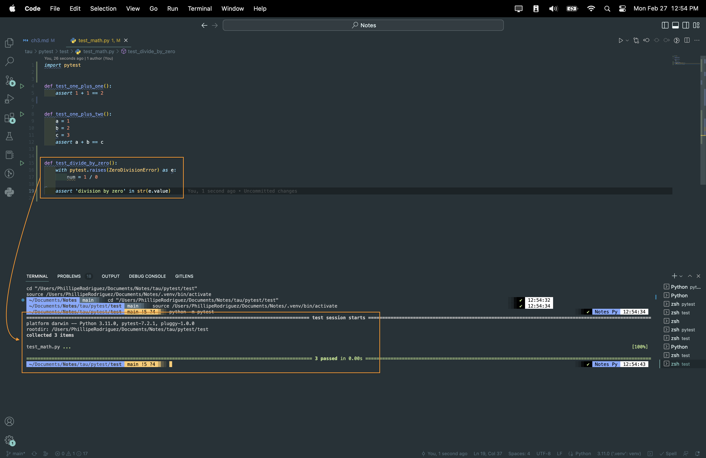
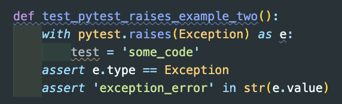

### Chapter 3: A Test Case with an Exception

##### Exceptions

1. _Reminder_ -  any raised exception that's not handled in a test case will fail it.
2. To verify exceptions inside a test case, you would code a try/except block. Python handles this with `python.raises`.
3. Adding a third test case to verify that dividing by zero raises an exception.

 

###### Handling exceptions with `pytest.raises`

`pytest.raises` code sample:

 

1. To use `pytest.raises`, you need to import pytest into the test module.
2. Wrap `pytest.raises` with the `with` statement to `enter` and `exit` logic for the caller.
3. Store the raised `exception_object` for further assertions.
4. Add `code block` logic.
5. `assert` the desired exception type to verify if it was raised.

 

##### Additional Notes

1. Structure to utilize `pytest.raises`: 
   1. `with` statement = `with pytest.raises(ValueError/Exception/exception_name)` +
   2. [ _optional_ ] `as` pattern + `keyword` + `colon`  = `as defined_keyword:` +
   3. `Code block`
   4. [ _optional_ ] `assert` + `exception_info` object + `.type/value/traceback/etc`

4. `with` statement: used to wrap the execution of a block with methods defined by a context manager, `pytest.raises`. A special statement for automatically handling extra "enter" and "exit" logic for a caller. **Most commonly used for file input and output**. Its execution steps are as follows:
   1. Context expression (`with pytest.raises()`) is evaluated to obtain a context manager.
   2. Manager's `_enter_()` is loaded for later use.
   3. Manager's `_exit_()` is loaded for later use.
   4. Manager's `_enter_()` method is invoked [ _opens the file and makes the code catch any exceptions_ ].
   5. If a target was included in the `with` statement, the `return value` from `_enter_()` is assigned to it.
   6. Suite is executed.
   7. Manager's `_exit_()` method is invoked [ _closes the file and asserts if the desired exception type was raised_ ].
      - If an `exception` caused the suite to exit, its `type`, `value`, and `traceback` are passed as arguments to `_exit_()`. If not, `None` is supplied for all 3 arguments. 
      - If the suite exit due to an `exception`, the `return value` from `_exit_()` method was false, the `exception` is reraised. If `return value` was true, the `exception` is suppressed, and execution continues the statement following the `with` statement.
      - If the suite exit for any reason other than an `exception`, the `return value` is ignored, and execution proceeds at the normal location for the kind of exit that was taken.
5. `as` pattern: binds the subject (`ValueError` or `Exception`) from the `with` statement to the given name on the right of the keyword/pattern.
6. `assert` statement: insert debugging assertions into a program. This is a built-in variable in Python. 
