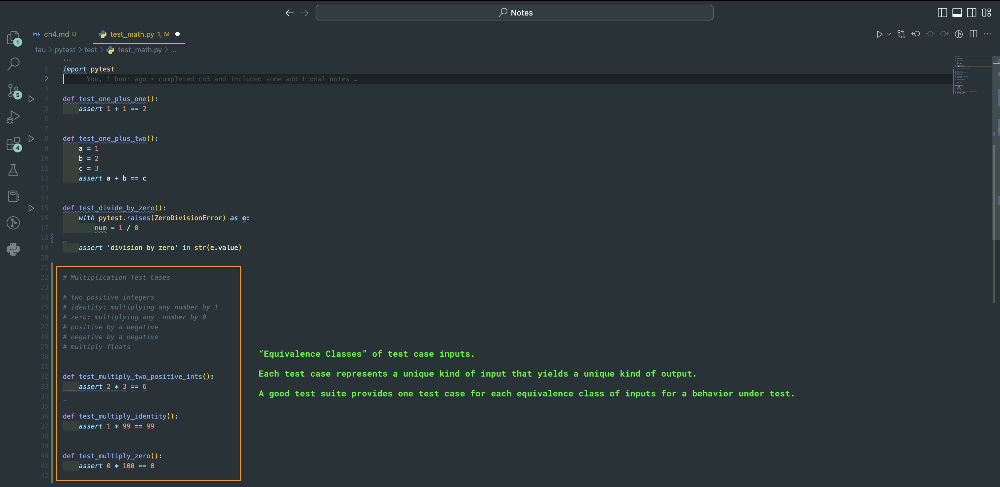
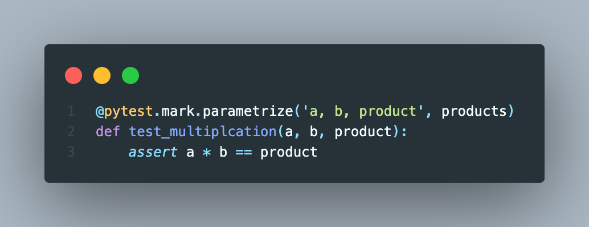

### Chapter 4: Parametrized Test Cases

##### Decorator: `@pytest.mark.parametrize()`

1. `@pytest.mark.parametrize`: is a decorator, meaning a special function that wraps around another function [ _a simple form of aspect-oriented programming_ ].
2. Two arguments are passed for the decorator:
   1. First argument = a string containing a comma-separated list of variables.
   2. Second argument = list of parametrized values [ _length of each tuple must match_ ].
3. The inner function wrapped by `@pytest.mark.parametrize` is the test case and is called by the decorator once per input tuple.
 

##### Equivalence Classes and Code Duplication Issues

1. Sometimes, testing behaviors can have different kinds of inputs and outputs. This may also include specific boundary cases.
2. For example, different multiplication test cases. 

3. For the above example, they are called ***equivalence classes*** of test case inputs, representing unique inputs yielding unique outputs.
   1. Reminder: avoid unnecessary tests that add time and cost for little value in return [ _code duplication_ ]
   2. The above example shows this repetitiveness. 
   3. Maintaining multiple copies of the same logic becomes burdensome.
 

##### Solution by utilizing `@pytest.mark.parametrize`

1. Must have `import pytest` into the test module.
2. Write a list of tuples in which each tuple represents an equivalent class of inputs and outputs. 

3. Write one test case function [ _inner function_ ] that will need arguments for both inputs and output and add `assert` statement to test multiplication.

4. To pass the parametrized values into the new test case function, wrap the test case function with a decorator `@pytest.mark.parametrize`. The decorator will call the inner test case once per input tuple.
5. The decorator will need to pass two arguments:
   1. First argument = string containing a comma-separated list of variables [ _matching the arguments from the test case function_ ].
   2. Second argument = list of parametrized values.

6. Run the test.

 

##### Additional Notes

1. Pytest parameters eases data-driven testing when test cases go through multiple inputs.
2. Any Python object types for the parameter values.
3. Since parameters are passed into the test case as a list, you can also store data in external files like CSVs or Excel and read them in when the test runs.
4. Testing cloning repo (modified my local directories recently).