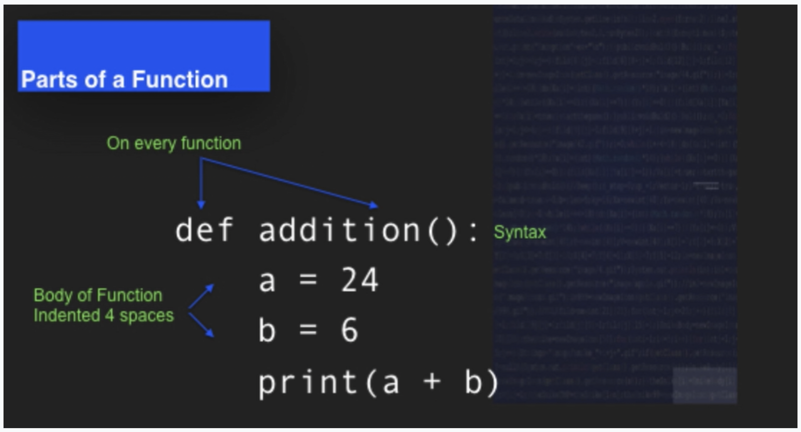
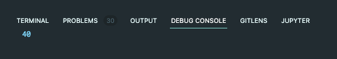
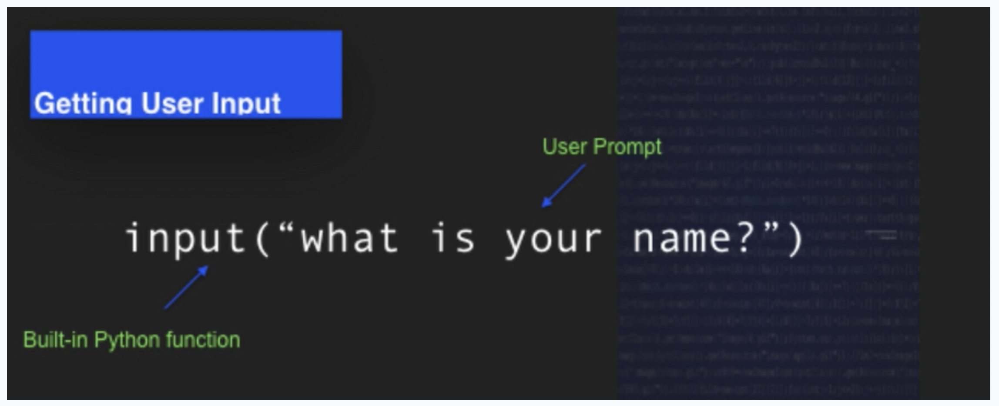

### Functions

A function is a unit of reusable and modular code.

```
def setUp(self):
    self.browser = webdriver.Firefox()
    self.addCleanup(self.browser.quit)

def testPageTitle(self):
    self.browser.get('http://www.google.com')
    self.assertIn('Google', self.browser.title)
```

<br>

#### Parts of a Function



Every function starts with a `def`,a unique name followed by parenthesis, and ends with a colon - `def Function_Name():`

**Example**

```
def addition():
    a = 10
    b = 30
    print(a + b)

addition()
```


<br>

#### Getting User Input



User prompt is a question or direction given to the user. Data type for both promp and input will be `str`. You can convert the `str` data by using `int` function.

**Example**

```
def addition():
    a = int(input("Enter a number"))
    b = int(input("Enter another number"))
    print(a + b)

addition()
```
