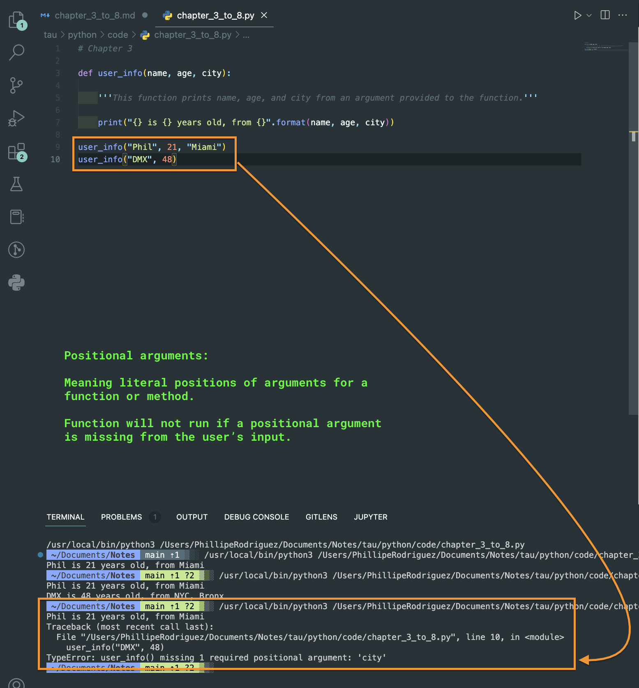
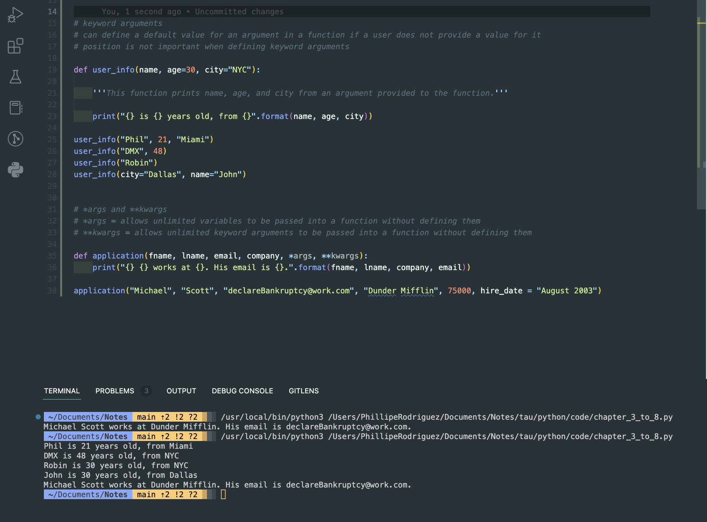
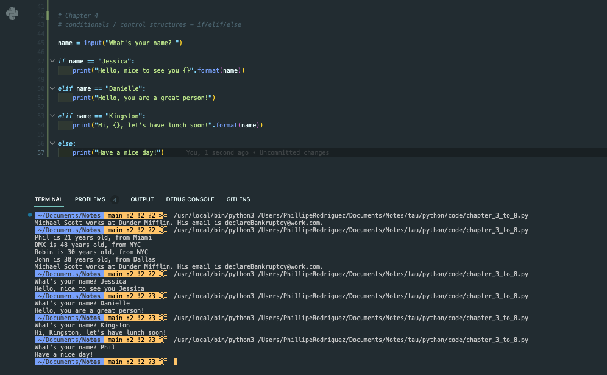
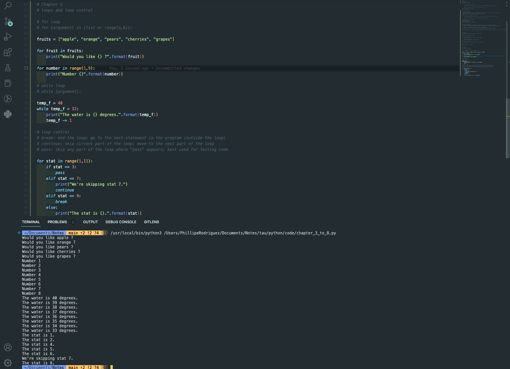

### Chapter 3 - 8

 

#### Chapter 3: `args`, `kwargs`, `*args`

##### Positional Arguments

This is frequently used in Selenium, so important to know. Its title is the literal meaning. Picture below.

 

##### Keyword Arguments & `*args` `**kwargs`

 

##### Conditionals: `if`/`elif`/`else`

 

##### Loops & Loop Control

 

##### Lists & List Methods / Dictionaries & Dict Methods
